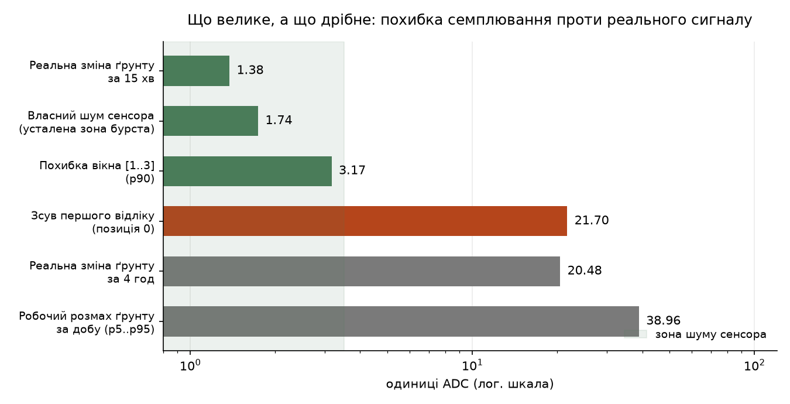
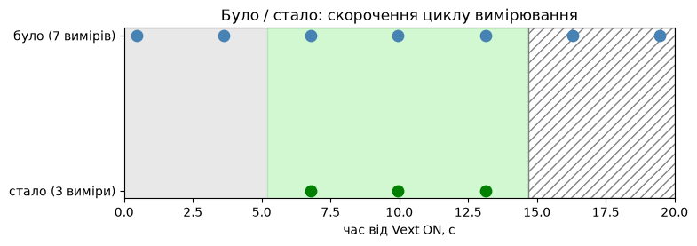

> [English version](./README.md)

# Agro — автоматизація теплиць (LoRa + ESP32)

Система моніторингу й керування комерційними теплицями невеликого господарства. Датчики в кожній теплиці передають дані по LoRa-радіо на шлюз, звідти вони потрапляють на Raspberry Pi, де працює бекенд, а далі йдуть у Telegram у вигляді зрозумілих сповіщень.

Головний користувач — оператор без технічної підготовки. Тому пріоритет на прості Telegram-сповіщення зрозумілою мовою, а не складні дашборди.

📖 Сайт документації: [agro-docs.vercel.app](https://agro-docs.vercel.app/) · 📽 Презентації: [agro-docs.vercel.app/slides](https://agro-docs.vercel.app/slides/) · 📓 Ноутбуки: [`notebooks/`](./notebooks/)

Проект також є портфоліо для вакансій в оборонному секторі: вбудовані системи, LoRa-радіозв'язок, повний стек і реальне польове розгортання.

## Масштаб

Наразі вісім теплиць: п'ять основних робочих з огірками й помідорами, одна розсадна (виступає хабом системи), одна нова стандартна й одна нова двоплівкова. Теплиці розкидані на дистанції від 50 до 250 метрів. Фаза 1 покриває три сенсорні вузли й один шлюз.

## LoRa-вузол

Кожна теплиця — автономний LoRa-вузол на **Heltec WiFi LoRa 32 V3** (ESP32-S3 + SX1262). Несе SHT31 (температура/вологість повітря) і ємнісний датчик вологості ґрунту, звітує на шлюз по LoRa 868 МГц.


Повний пінаут, підключення й прошивка — [`firmware/README-UA.md`](./firmware/README-UA.md).

## Характеризація ґрунтового сенсора (v1.2 проти v2.0)

Заміряно у відрі з 1 кг ґрунту, вода доливалась порціями, вивід писався як сире
ADC і мілівольти по USB окремою стендовою прошивкою
([`firmware/soil-calibration`](./firmware/soil-calibration)). По два екземпляри
кожної версії, той самий канал ADC, та сама ямка, той самий ґрунт — тож різниця
може прийти тільки від сенсора.

| | v1.2 | v2.0 | |
|---|---:|---:|---|
| повітря | 2229 мВ | 2721 мВ | |
| сухий ґрунт | 2101 мВ | 2409 мВ | |
| шум σ | 2,9 мВ | **1,05 мВ** | у 2,8 раза тихіше |
| прогрів `T±10` | 0,4 с | **0,1 с** | у 4 рази швидше |
| чутливість до води | 12,6 мВ/мл | 12,1 мВ/мл | **однакова** |

Прогрів `T±10` заміряно на стенді, **без циклу deep sleep**. У полі перший
відлік через 87 мс після пробудження стабільно занижений на 22 одиниці — чи то
сенсор, чи то ADC після холодного старту плати, поточні дані не розрізняють
([`docs/дослідження/оптимізація-вікна-семплювання.md`](./docs/дослідження/оптимізація-вікна-семплювання.md)).

**v2.0 виграє, але не з тієї причини, яку підказував розмах повітря → ґрунт.**
Той розмах у v2.0 ширший у 2,4 раза — і виявився поганим передбачником: обидві
версії зсуваються майже однаково на кожен мілілітр води. Справжня перевага —
**≈3×, і вона вся з шуму**. Оскільки на батарейному вузлі 5 В нема взагалі (пін
5V на Heltec V3 живиться від USB), а v1.2 конструктивно 5-вольтовий і на 3,3 В
має стиснутий діапазон, у вузол іде резервна партія.

Скільки з цього можна вірити, вирішив контрольний замір: `v1.2-A` поставили в
ямку вдруге наприкінці сесії, і він розійшовся з власним першим заміром на
**9 мВ** — це відтворюваність усієї процедури, а не шум ADC. Проти такої
лінійки різниця версій у 310 мВ це 34 похибки, вона вистояла; а розкид 2–5 мВ
між екземплярами однієї партії менший за похибку, і його відкликали як
незміряний.

### Крива калібрування: влита вода проти показника


Кожен наступний долив зсуває показник менше за попередній — сенсор насичується.
Описується як геометричне спадання кроку, що є тією самою експонентою,
записаною двома способами:

```
мВ(V) = C + A · r^(V / крок)     ≡     C + A · e^(−V/k),   k = −крок / ln r
```

Заміряно на v2.0: **r ≈ 0,35** — кожні наступні 50 мл роблять близько 35%
роботи попередніх; те саме, що **k ≈ 52 мл**. RMS підгонки 9,7 мВ на діапазоні
1535 мВ, тобто 0,6%.

Наслідок — **розкид чутливості у 240 разів**: 12,0 мВ на мілілітр у сухому
ґрунті проти 0,05 у політій грядці.

### Чому відсоток логарифмічний


На осі **води** логарифмічна шкала — пряма, а `map()` вигинається; котра з двох
відповідає фізиці, видно з одного погляду. Половина влитої води дає **50%**,
тоді як лінійна називає той самий ґрунт **94%**.

Стовпчики — той самий факт у розрізі однакових порцій по 25 мл: лінійна дає
першій порції **38 пунктів**, а останній **0,3** — різниця у 128 разів за ту
саму кількість води. Логарифмічна дає всім порціям однакову вагу.

Лінійний `map()` розподіляє відсотки рівномірно **по напрузі**, а не по воді, і
з'їдає всю мокру половину діапазону — саме ту, у якій теплиця й живе. Його
середина показує 89% там, де ґрунт пройшов лише половину шляху.

Прошивка натомість перетворює через заміряну криву й везе **сире ADC поруч із
відсотком**: відсоток це тлумачення, чия шкала ще не остаточна, а сире значення
— сам вимір, і воно дозволяє перерахувати всю історію без перепрошивки вузлів
у полі.

До цього ми дійшли з власних вимірів і лише потім звірились із літературою —
де воно виявилось **рекомендованою практикою**, а не нашим винаходом. Рівняння
Топпа (1980) це кубічний поліном; роботи з польового калібрування описують
*«двоточкову модель і експоненційну підгонку»* та зазначають, що **двоточкові
лінійні методи простіші й практичніші для поля, а підгонка кривої дає вищу
точність за належного калібрування під конкретний ґрунт**. Там же прямо
сказано, що **калібрування виробника недостатнє й потрібне перекалібрування
під свій ґрунт** — саме цим і були два дні вимірів у відрі.

Одна чесна різниця: у літературі еталон — **гравіметрична вологість**
(зважування й сушіння), у нас — влита вода. Тому наша шкала **відносна** і на
θ у м³/м³ не претендує.

Метод, числа й джерела: [`docs/дослідження/нелінійна-шкала.md`](./docs/дослідження/нелінійна-шкала.md),
[`docs/дослідження/калібрування-ґрунту.md`](./docs/дослідження/калібрування-ґрунту.md).

## Безперервний вузол проти інтервального

Етап 3: два вузли поруч, у тому самому ґрунті. Один шле безперервно від USB,
другий спить по 5 хвилин і виходить в ефір на 19,5 с. Питання просте — скільки
даних коштує сон.



**Відповідь: майже нічого.** Реальна вологість ґрунту змінюється за 15 хвилин
на 1,38 одиниці ADC — це **менше за власний шум сенсора** (1,74). Похибка
усередненого вікна з трьох відліків (p90 = 3,17) лежить там само. Проти
робочого добового розмаху в 39 одиниць усе це не читається.

Той самий висновок з іншого боку: якщо з 44 410 відліків безперервного вузла
залишити лише те, що бачив би інтервальний, похибка виходить у 5–45 разів
**меншою** за дрижання самого сенсора — 1,2 одиниці проти 55, 0,07 °C проти
0,20 °C. Безперервний вузол витрачає у 22 рази більше передач, щоб розрізняти
те, що дрібніше за його власний шум.

Дорого коштує не сон, а **перший відлік після пробудження**: він занижений на
22 одиниці стабільно, у 442 бурстах із 442 — стільки ж, на скільки ґрунт
змінюється за чотири години.



Звідси й оптимізація: відкинути перший відлік, лишити три замість семи, вікно
`Vext` падає з 19,5 с до 9,5 с, а ефір з 2,0% до 0,86% — уперше в межах ліміту
ETSI. Реальна економія батареї при цьому **не заміряна**: `vbat` дає напругу, а
не струм, і для чесного числа потрібен струмовий сенсор, якого нема.

Метод, таблиці й межі висновків:
[`docs/дослідження/оптимізація-вікна-семплювання.md`](./docs/дослідження/оптимізація-вікна-семплювання.md).

## Витік у сні: 0,84 мА замість 0,135

Вузол у deep sleep їв **0,94 мА** — у сім разів більше за розрахунок, і це була
стеля, нижче якої не опустила б жодна оптимізація логіки. Бісекція збірками
показала, що прошивка, в якій немає **нічого**, крім `esp_deep_sleep_start()`,
дає 0,84 мА: отже витік не в тому, що вузол робить, а в тому, як він лягає
спати. Причина — периферійні піни, які лишались виходами й підживлювали входи
вже сплячих SX1262 та SSD1306.

Після переведення всіх п'ятнадцяти в `INPUT` і холодного сну радіо прилад
показав **0,01 мА** — нижню значущу цифру свого діапазону, тобто щонайменше у
84 рази менше. Рецепт узятий з [ropg/heltec_esp32_lora_v3](https://github.com/ropg/heltec_esp32_lora_v3),
де для цієї ж плати заявлено 24 мкА при пробудженні за таймером; спільнота
Heltec [називає 130–135 мкА](http://community.heltec.cn/t/heltec-lora-32-v3-deep-sleep-current/18332)
як звичайний результат.

Кожен крок — окрема прошивка, що відрізняється від сусідньої рівно одним
доданим блоком, прилад увесь час у розриві «мінуса» банки:

| крок | струм | що змінилось |
|---|---:|---|
| `step_a_sleep` — лише сон, більше нічого | 0,84&nbsp;мА | радіо ніхто не присипляв |
| `step_b_radio` — плюс штатний `radio.sleep()` | 0,70&nbsp;мА | радіо: **−0,14** |
| `step_e_ropg` — плюс усі піни в `INPUT` | **0,01&nbsp;мА** | піни: **−0,69** |
| бойова прошивка (контроль) | 0,94&nbsp;мА | піни від I2C та дисплея теж |

Піни коштували вп'ятеро більше за радіо. Останній рядок лягає в ту саму
картину без залишку: бойова прошивка їла більше за голий крок A саме тому, що
піднімає ще дві шини I2C і дисплей — тобто лишає виходами більше пінів.

Наслідок для платформи: сон перестав бути стелею. Тепер бюджет циклу — це майже
виключно вікно семплювання (39,5 мА проти 0,01 мА уві сні, курс обміну 1:4000),
і при циклі 15 хвилин розрахунковий ресурс піднімається з 73 діб до ~137, а
разом зі скороченим вікном — до дев'яти місяців.

Прошивки під замір і протокол бісекції: [`firmware/power-bisect`](./firmware/power-bisect),
розбір — [`docs/дослідження/струм-сну.md`](./docs/дослідження/струм-сну.md).

## Архітектура коротко

Кожна теплиця — автономний вузол на ESP32 з датчиками, який передає показники по LoRa на частоті 868 МГц. Дані стікаються на центральний шлюз у розсадній теплиці, звідти через USB потрапляють на Raspberry Pi. На малині працює бекенд на Python (FastAPI + SQLite), який зберігає всі виміри й формує сповіщення. Готові до дії повідомлення йдуть оператору через Telegram-бота. Детальний опис — у файлі [`docs/довідка/architecture.md`](./docs/довідка/architecture.md).

### Потік даних

```
                    Теплиця
  ┌───────────────────────────────────────────────────┐
  │                                                   │
  │   ┌───────────────────────────────────────────┐   │
  │   │  LoRa-вузол — Heltec V3 (ESP32-S3+SX1262) │   │
  │   │                                           │   │
  │   │   ┌──────────────┐  ┌──────────────────┐  │   │
  │   │   │ SHT31        │  │ Ємнісний датчик  │  │   │
  │   │   │ темп. повітря│  │ вологості ґрунту │  │   │
  │   │   │ вологість    │  │ v1.2             │  │   │
  │   │   └──────────────┘  └──────────────────┘  │   │
  │   └───────────────────┬───────────────────────┘   │
  └───────────────────────┼───────────────────────────┘
                          │ LoRa 868 МГц
                          ▼
                  ┌───────────────────┐
                  │  Шлюз-вузол       │
                  │  (Heltec V3)      │
                  └─────────┬─────────┘
                            │ USB
                            ▼
                  ┌───────────────────┐
                  │  Raspberry Pi 5   │
                  │  FastAPI + SQLite │
                  │  Логіка алертів   │
                  └─────────┬─────────┘
                            │ Telegram Bot API
                            ▼
                  ┌───────────────────┐
                  │  Оператор         │
                  │  (Telegram)       │
                  └───────────────────┘
```

### Логічна ієрархія

Кожна теплиця містить один LoRa-вузол, а той несе декілька сенсорів. Бекенд організовує конфіг і алертинг навколо цієї триярусної структури:

```
agro-server
├── greenhouses/
│   ├── greenhouse-1  "Розсадна (огірки)"
│   │   └── LoRa-вузол (Heltec V3)
│   │       ├── SHT31       → повітря температура, вологість
│   │       └── Ємнісний    → вологість ґрунту
│   ├── greenhouse-2  "Огірки основна"
│   │   └── LoRa-вузол
│   │       ├── SHT31       → повітря температура, вологість
│   │       └── Ємнісний    → вологість ґрунту
│   └── ...
└── notifiers/
    └── Telegram  (свій бот АБО через bot hub)
```

Пороги алертів і конфіг живуть на рівні теплиці. Окремий датчик може перекрити витримку (`dwell_minutes`); загальний блок `defaults` застосовується інакше.

## Структура репозиторію

Папка `server` — бекенд, який приймає, зберігає й віддає дані. Розробляється на комп'ютері, потім переноситься на Raspberry Pi без змін. Стек: Python, FastAPI, SQLite (через SQLModel).

Папка `firmware` — прошивки вузлів і шлюзу. Мова C++ (Arduino або PlatformIO).

Папка `docs` — документація, схеми й журнал емпіричних порогів. Формат Markdown.

Папка `documentation` — джерело сайту [agro-docs.vercel.app](https://agro-docs.vercel.app/), разом із колодами слайдів у `slides/`.

Папка `notebooks` — Jupyter-ноутбуки й знімки даних, на яких стоять висновки досліджень.

## Фази

Перша фаза — моніторинг: датчики, графіки й Telegram-алерти, без виконавчих механізмів. Друга — полив: помпа або клапан за розкладом плюс датчик вологості ґрунту. Третя — вентиляція й температура: актуатор кватирки або витяжний вентилятор.

## Моделі розгортання

Код підтримує **дві моделі дистрибуції**, які обираються конфігом. Обидві моделі використовують той самий кор-код — відрізняється лише notifier-шар.

**Модель А — Self-hosted (open source).** Кожен оператор клонує репо, стартує сервер на своєму Raspberry Pi, створює свого Telegram-бота через @BotFather. Дані повністю у власника, без зовнішніх залежностей.

```
    ┌──────────────────┐
    │ Свій бот         │  (створений через @BotFather)
    │ (@Farmer1Bot)    │
    └────────┬─────────┘
             │
    ┌────────▼─────────┐
    │ agro-server #1   │  (своя БД, свій конфіг)
    └──────────────────┘
```

**Модель Б — Центральний hub (SaaS).** Один Telegram-бот обслуговує багато ізольованих інстансів `agro-server`. Юзери реєструються на hub-і, зв'язуються з ботом через deep link, hub маршрутизує повідомлення до правильного сервера. Дозволяє керовані розгортання для нетехнічних операторів.

```
                    ┌─────────────────────────┐
                    │  agro-bot-hub (SaaS)    │
                    │  @AgroMonitorBot        │
                    │  Route: token → server  │
                    └──────┬──────────────────┘
                           │
        ┌──────────────────┼──────────────────┐
        ▼                  ▼                  ▼
   ┌─────────┐        ┌─────────┐        ┌─────────┐
   │agro-#1  │        │agro-#2  │        │agro-#3  │
   │Фермер 1 │        │Фермер 2 │        │  SaaS   │
   └─────────┘        └─────────┘        └─────────┘
```

**Візуальне дерево — верхній шар показує модель ізоляції, далі розгорнуто тільки `agro-#1` і `greenhouse-1`. `agro-#2` і `agro-#3` мають ідентичну форму:**

```
                                      ┌──────────────────┐
                                      │  agro-bot-hub    │
                                      │ @AgroMonitorBot  │
                                      └────────┬─────────┘
                                               │
                    ┌──────────────────────────┼──────────────────────────┐
                    ▼                          ▼                          ▼
             ┌─────────────┐            ┌─────────────┐            ┌─────────────┐
             │  agro-#1    │            │  agro-#2    │            │  agro-#3    │
             │  Фермер 1   │            │  Фермер 2   │            │    SaaS     │
             └──────┬──────┘            └─────────────┘            └─────────────┘
                    │
           ┌────────┴────────┐
           ▼                 ▼
    ┌─────────────┐   ┌─────────────┐
    │greenhouse-1 │   │greenhouse-2 │
    │   (LoRa)    │   │   (LoRa)    │
    └──────┬──────┘   └─────────────┘
           │
     ┌─────┼─────┐
     ▼     ▼     ▼
   ┌───┐ ┌───┐ ┌───┐
   │s-1│ │s-2│ │s-3│
   └───┘ └───┘ └───┘
```

**Повна розгорнута ієрархія — кожен ізольований інстанс містить кілька теплиць, кожна зі своїми сенсорами:**

```
agro-bot-hub  (@AgroMonitorBot)
│
├── agro-#1  (Фермер 1)
│   ├── greenhouse-1  (LoRa-вузол)
│   │   ├── sensor-1  (SHT31 → температура повітря)
│   │   ├── sensor-2  (SHT31 → вологість повітря)
│   │   └── sensor-3  (ємнісний → вологість ґрунту)
│   ├── greenhouse-2  (LoRa-вузол)
│   │   ├── sensor-1
│   │   ├── sensor-2
│   │   └── sensor-3
│   └── ...  більше теплиць
│
├── agro-#2  (Фермер 2)
│   ├── greenhouse-1  (LoRa-вузол)
│   │   ├── sensor-1
│   │   ├── sensor-2
│   │   └── sensor-3
│   ├── greenhouse-2
│   │   └── ...
│   └── ...
│
└── agro-#3  (SaaS)
    ├── greenhouse-1
    │   └── ...
    └── ...
```

Кожен `agro-#N` — це повністю ізольоване розгортання `agro-server` зі своєю базою й теплицями. `agro-bot-hub` маршрутизує повідомлення між спільним Telegram-ботом і потрібним інстансом за допомогою per-user токена, який видається при зв'язуванні Telegram-акаунта.

Модель вибирається одним прапорцем у `.env`: `NOTIFIER=telegram_direct` (свій бот) vs `NOTIFIER=telegram_hub` (спільний hub). Детальний дизайн — у [`docs/довідка/alerts.md`](./docs/довідка/alerts.md).

## Технічний стек

Heltec WiFi LoRa 32 V3 (ESP32-S3 з чипом SX1262, 868 МГц), Raspberry Pi 5, FastAPI, SQLite, Telegram Bot API. Датчики: SHT31 для температури й вологості повітря та ємнісні датчики вологості ґрунту версії 1.2.

Повний реєстр закупленого заліза — що вже в схемі, що в резерві, а що взяте на майбутнє — у [`docs/довідка/комплектуючі.md`](./docs/довідка/комплектуючі.md).
