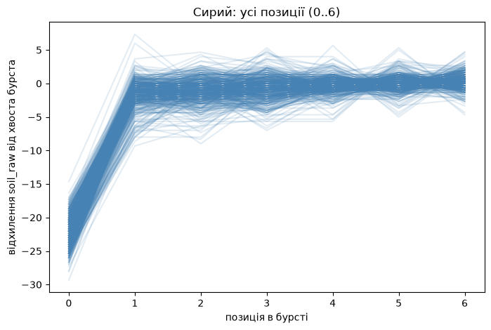
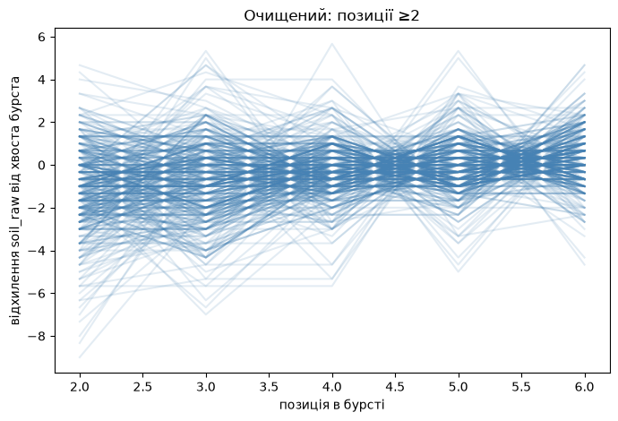
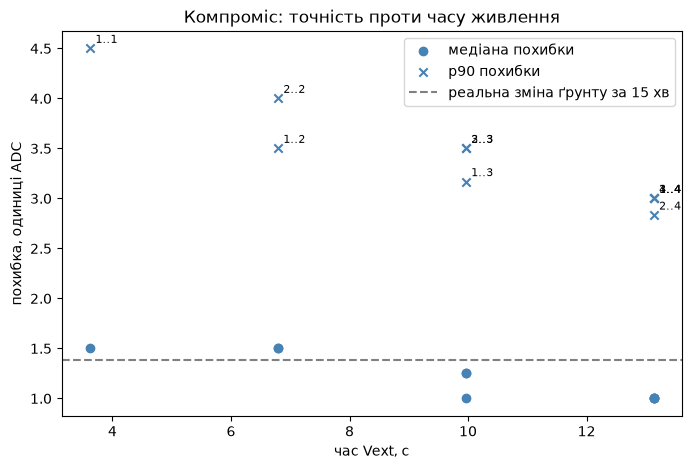
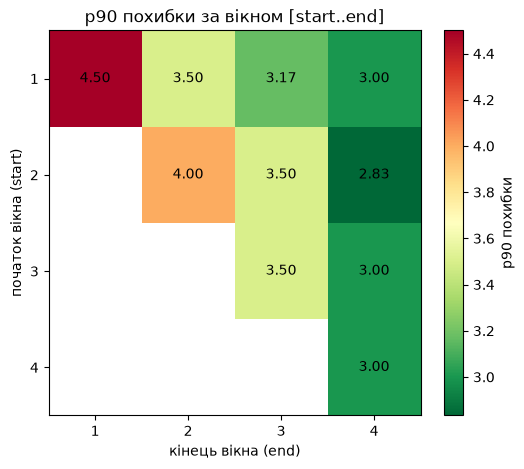

# Оптимізація вікна семплювання на інтервальному вузлі

Скільки відліків має робити вузол за одне пробудження, коли їх слати, і що з
цього коштує батареї. Аналіз на живих даних етапу 3, серпень 2026.

Ноутбуки з розрахунками — `notebooks/`
(`01_burst_shape`, `02_trend_dynamics`, `03_window_selection`).

## Питання

`greenhouse-node-lowpower` прокидається раз на 5 хвилин, тримає `Vext` 19,5
секунди й шле за цей час **сім окремих пакетів** — по одному на кожен відлік.
Так зроблено свідомо (`platformio.ini`, коміт `1359c02`): один відлік на цикл
нема з чим порівняти, викид від наводки не відрізнити від справжньої зміни
вологості.

Питання не «чи потрібне вікно», а **наскільки воно має бути довгим**. Кожна
зайва секунда `Vext` — це живлення сенсора, а кожен зайвий пакет — 857 мс
роботи передавача.

## Як влаштований цикл насправді

Сітка відліків, заміряна по полю `soil_at_ms` (доїжджає з `79ba012`):

```
Vext ON
├─  0.087 s   поз 0   ← перший відлік, майже одразу
│             ⟵ 3,1 с без жодного заміру
├─  3.23  s   поз 1
├─  6.38  s   поз 2
├─  9.52  s   поз 3
├─ 12.67  s   поз 4
├─ 15.81  s   поз 5
└─ 18.96  s   поз 6   → deep sleep
```

Такт — **3,15 с**, не 2 с, як обіцяє `SAMPLE_EVERY_MS = 2000`. Причина в
`main.cpp`: `delay(SAMPLE_EVERY_MS)` стоїть **після** `radio.transmit()`, тож
до паузи додається 857 мс передачі й час читання сенсорів. Константа називає
паузу між відліками, а читається як період — це різні речі.

## Що виміряно

### 1. Перший відлік систематично занижений



Позиція 0 лежить на **−22 одиниці ADC** нижче за решту бурста. Не «переважно»,
не «у більшості випадків» — **у 442 бурстах із 442**, зі стандартним відхиленням
розкиду 2,3. Це не шум, а передбачуваний зсув в один бік.

Прибираємо позиції 0 і 1 — і залишається рівна поличка:



Власний шум сенсора всередині усталеної зони — **1,74 одиниці**.

### 2. Реальний ґрунт за 15 хвилин майже не рухається

Опорний вузол міряв безперервно (кожні 2,7 с), тож із нього видно справжню
динаміку без домішки семплювання. Ресемпл у 15-хвилинні бакети:

| проміжок | медіана зміни | максимум |
|---|---:|---:|
| 15 хв | **1,38** | 10,5 |
| 4 год | 20,5 | 36,9 |
| доба (розмах p5..p95) | 39,0 | |

**Зміна за 15 хвилин (1,38) менша за власний шум сенсора (1,74).** Тобто в
межах одного бурста (19,5 с) реальному сигналу нічому мінятись — усереднення
відліків прибирає шум і не втрачає нічого.

І зворотний бік тієї ж лінійки: зсув першого відліку (−22) приблизно дорівнює
тому, на скільки ґрунт змінюється **за чотири години**. Один невідкинутий
відлік коштує стільки ж, скільки чотири години застарілих даних.

### 3. Вибір вікна

Вікно `[start..end]` усереднюється, похибка рахується проти усталеного плато
бурста:

| вікно | відліків | час `Vext` | медіана похибки | p90 |
|---|---:|---:|---:|---:|
| `[1..1]` | 1 | 3,2 с | 1,50 | 4,50 |
| `[2..2]` | 1 | 6,4 с | 1,50 | 4,00 |
| `[1..3]` | 3 | 9,5 с | 1,25 | **3,17** |
| `[2..4]` | 3 | 12,7 с | 1,00 | **2,83** |
| `[3..4]` | 2 | 12,7 с | 1,00 | 3,00 |





Два кандидати — `[1..3]` і `[2..4]`. Різниця в точності (3,17 проти 2,83) сама
лежить у межах похибки оцінки на 442 бурстах, тож вибір між ними вільний:
`[2..4]` трохи точніше, `[1..3]` дешевше на 3,2 с живлення.

**Три відліки, а не два** — попри те, що `[3..4]` дає схожу точність. У
нормальному режимі один пакет із семи губиться приблизно в **2,8%** бурстів
(12 неповних із 428 за добу 26.08). При трьох відліках втрата одного лишає два
для усереднення, при двох — лишає один, без страховки.


## Головне: похибка інтервального вузла лежить у зоні шуму


Три верхні смуги — це все, що коштує рідке семплювання. Три нижні — реальний
сигнал, заради якого система існує. Між ними порядок величини.

Той самий висновок з іншого боку: якщо взяти щільний потік опорного вузла
(44 410 відліків кожні 2,7 с) і залишити з нього тільки те, що бачив би
інтервальний, похибка виходить така:

| | похибка рідкого семплювання | власний шум сенсора за 5 хв |
|---|---:|---:|
| `soil_raw` | медіана 1,2, p95 5 | 55 |
| температура повітря | 0,07 °C | 0,20 °C |
| вологість повітря | 0,25 % | 1,4 % |

**Втрата від рідкого семплювання в 5–45 разів менша за дрижання самого
сенсора.** Безперервний вузол витрачає у 22 рази більше передач (1323 проти 59
на годину), щоб розрізняти те, що дрібніше за його власний шум.

Єдине, що рідке семплювання справді пропускає — швидкі події: максимальні
похибки (334 одиниці, 2,3 °C) припадають на моменти, коли щуп смикнули або
відчинили двері. Для вологості ґрунту це не той клас сигналу.

## Що з цього випливає для прошивки

**1. Відкидати позицію 0.** Безкоштовно: відлік уже робиться, він просто не
має потрапляти ні в передачу, ні в середнє. Мінус 22 одиниці систематичного
зсуву.

**2. Вікно `[1..3]` замість `[0..6]`.** Три відліки замість семи, ~9,5 с
`Vext` замість 19,5 — на 51% менше часу живлення периферії.

**3. Найбільший важіль — розчепити відлік і передачу.** Уся таблиця вище
рахувалась за нинішньої схеми «один відлік = один пакет», через яку такт і
становить 3,15 с. Якщо натомість зняти три відліки поспіль і надіслати **один**
пакет із медіаною й розкидом, вікно `Vext` падає до ~2 с, а ефір — до однієї
передачі. Це дешевше за будь-який рядок таблиці.

Одна умова, якої дані не перевіряють: чи лишається шум некорельованим на
коротких проміжках. Якщо 1,74 одиниці — це білий шум ADC, три відліки поспіль
усереднюються так само добре, як три через 3 секунди. Якщо там повільне
коливання пікового детектора 555 — не усередняться. Перевіряється середовищем
`lowpower_probe`.

**4. Ефір заодно приходить у норму.** Ліміт ETSI на 868,0 МГц — 1% часу:

| схема | пакетів на цикл | ефір при циклі 5 хв |
|---|---:|---:|
| зараз | 7 | **2,0%** — удвічі над лімітом |
| вікно `[1..3]` | 3 | 0,86% |
| один пакет на цикл | 1 | 0,29% |

## Чого цей аналіз НЕ каже

**Реальної економії батареї тут нема.** `vbat` — це напруга, а не струм і не
енергія. Усе, що вище, міряє **час живлення периферії**, і перерахунок цього
часу в години роботи потребує струмового сенсора (INA219/INA226), якого в
закупці нема. Зафіксовано як обмеження.

Часткова заміна, доступна вже зараз: **відношення** споживання міряється
кривою розряду тієї самої банки — прогнати вузол на двох конфігураціях і
порівняти нахили. Все, що не змінилось (комірка, температура, її крива), при
цьому скорочується. Абсолютні мАг так не дістати, відносний виграш — так.

**Що саме сідає на позиції 0 — невідомо.** Спостереження «−22 на 87 мс після
пробудження» однаково добре пояснюється двома причинами:

- ємнісний сенсор ще не вийшов на поличку;
- ADC ESP32 не встоявся після **холодного старту всієї плати** — deep sleep це
  не просто зняття `Vext`, там заново калібрується ADC.

Стендовий замір 22.08 дав для v2.0 прогрів `T±10 = 0,1 с` — але то був замір
**без циклу deep sleep**, тобто інше питання. Розрізнити ці дві гіпотези
поточні дані не можуть: у проміжку між 0,087 с і 3,23 с відліків просто нема.

**Проміжок 0,1–3 с у даних порожній.** Не «мало точок» — нуль. Щоб його
побачити, треба зменшити `SAMPLE_EVERY_MS` або зробити окремий прогін
`lowpower_probe`, який пише криву в Serial. Тепер, коли `soil_at_ms` доїжджає
до бази, це видно буде на живих даних, а не на стенді.

## Джерела чисел

- дані: `measurement` на Pi, вузли `stage3-reference` (безперервний, помер
  25.08 21:17) і `stage3-lowpower` (сон 5 хв), вікно з 25.08
- 442 повні бурсти по 7 відліків
- позиція відліку відновлюється з розриву > 45 с між сусідніми записами;
  з `79ba012` є пряма мітка `soil_at_ms`
- енергетичні прикидки — `power-budget.md` (числа там датовані 21.08 і
  описують прошивку до вікна семплювання; середній струм там занижений)
