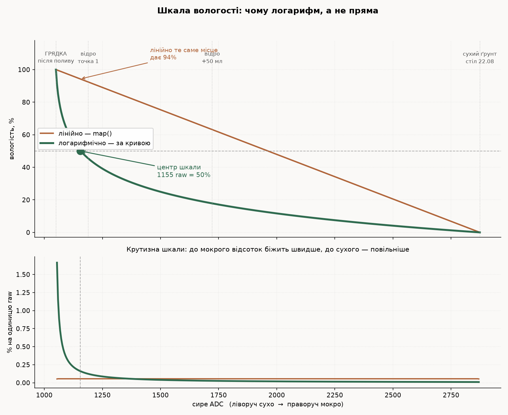

# Калібрування ґрунтових сенсорів — заміряні числа

Живий реєстр того, що реально показали наші сенсори. Заводиться заради двох
речей: **порівнювати нові екземпляри зі старими** і **не переміряти те, що вже
міряли**. Числа сюди дописуються, старі не переписуються — розбіжність між
партіями цікавіша за одне «правильне» значення.

Інструмент — `firmware/soil-calibration` (прошивка + `tools/`). Процедура
описана в його README; тут тільки результати.

> Усі напруги — мілівольти на AOUT при живленні **3,3 В**. На 5 В числа будуть
> іншими, і переносити їх не можна: діапазон виходу залежить від живлення.

---

## Метрика `T±k` — час виходу на полицю

Щоб «сенсор прогрівається за пів секунди» було твердженням, яке можна
перевірити й спростувати, а не враженням від графіка.

**Означення.** `T±k` — час від подачі живлення до моменту, **після якого**
крива вже не виходить за `±k` мВ від полиці до кінця вікна.

- **Полиця** — середнє останньої чверті вікна.
- **«Після якого», а не «перше влучання»**: крива, що перетнула допуск і
  поповзла далі, влучає рано й випадково. Нас цікавить момент, з якого
  показник можна брати не думаючи.
- **Початковий сплеск зараховується завжди** — живлення щойно подали, цей
  вихід ми самі спричинили, доводити його статистикою не треба.
- **Пізній вихід зараховується, лише якщо триває ≥ 3 зразки підряд.** Один
  зразок — це шум ADC, не поведінка сенсора. Без цього правила метрика дає
  «25,8 с» там, де сенсор устоявся за 0,4 с (реальний випадок, 2026-08-22).

**k береться три**, бо ціна різна: `T±50` — «видно, мокро чи сухо»; `T±10` —
«можна калібрувати». Для вузла зі сном різниця між ними — місяці ресурсу.

**Разом із числом обов'язково називається пауза без живлення.** `T±10 = 0,5 с
@ off 120 с` і `T±10 = 0,5 с @ off 3 с` — різні твердження: друге нічого не
каже про вузол, який спить 15 хвилин.

Рахує `firmware/soil-calibration/tools/soil_warmup.py`; вікно, крок і паузу
видно в шапці кожного збереженого CSV. Метрика мінялась двічі, тому старі
криві перераховуються без заліза:

```
uv run --with pyserial tools/soil_warmup.py --from-csv data/warmup-*.csv
```

---

## Метрика `R15` — усталений відлік після доливу

Друга метрика, і плутати її з `T±k` не можна: вони про різні речі й
відрізняються **на три порядки**.

| | `T±k` | `R15` |
|---|---|---|
| Що чекаємо | **сенсор** після подачі живлення | **ґрунт** після доливу води |
| Природа | заряд конденсатора детектора | рух води крізь ґрунт |
| Масштаб | **0,1–0,5 с** | **15 хвилин** |
| Від чого залежить | модель сенсора | ґрунт, об'єм, геометрія відра |

**Означення.** `R15` — показник, знятий **рівно через 15 хвилин** після доливу,
усереднений по останніх 60 секундах цього вікна.

**Чому фіксований час, а не «доки не встоїться».** Тому що «встоїться» не
настає: після доливу показник повзе ще довго, і навіть на 15-й хвилині
лишається +0,4 мВ/хв. Критерій «чекай, доки перестане рухатись» не має
термінації — на ньому можна просидіти годину.

**Чому саме 15.** Заміряно на реальній кривій:

| хв після доливу | дрейф |
|---:|---:|
| 1 | +20 мВ/хв |
| 5 | +7 мВ/хв |
| 10 | +3 мВ/хв |
| **15** | **+0,4 мВ/хв** |

Від 1-ї до 15-ї хвилини показник проходить ще **104 мВ**. На 15-й дрейф падає
до ~0,03 мл/хв в еквіваленті — тобто помилка від нестрогої витримки стає
меншою за роздільну здатність. Далі чекати нема сенсу: наступні 15 хвилин
дадуть менше мілівольта.

**Правило порівняння: `R15` порівнюється тільки з `R15`.** Точка, знята через
5 хвилин, лежить на ~50 мВ нижче — це не шум, це інша величина. Змішувати їх
у одній кривій означає внести систематичний зсув, який виглядатиме як
властивість ґрунту.

### Форма повернення: експонента зі сталою τ

Після доливу показник провалюється до `Rmin`, а тоді повертається вгору — вода
розходиться вглиб і вбік. Повернення описується експонентою:

```
R(t) = R15 − ΔR · exp(−t/τ)        ΔR = R15 − Rmin
```

Швидкість у будь-який момент:

```
dR/dt = (ΔR/τ) · exp(−t/τ)
```

Заміряно на реальних доливах (сенсор `v2.0-A`, 50 мл):

| Долив | `Rmin` | `R15` | `ΔR` | **τ** |
|---|---:|---:|---:|---:|
| точка 1 | 916 | 1018 | 102 мВ | **~2,5 хв** |
| точка 2 | 875 | 925 | 50 мВ | **~4,5 хв** |

Типова швидкість повернення для `ΔR ≈ 100 мВ`:

| хв від піку | dR/dt |
|---:|---:|
| 0,5 | +46 мВ/хв |
| 3 | +11 мВ/хв |
| 5 | +6 мВ/хв |
| 15 | **+0,2 мВ/хв** |

**τ росте з вологістю** — 2,5 хв у сухішому ґрунті проти 4,5 у насиченому.
Пори вже зайняті, воді нема куди швидко піти.

**Звідси й береться 15 хвилин:** це **3–6 сталих часу**, тобто 95–99,8%
повернення завершено, а залишок менший за роздільну здатність. Число не кругле
з голови — воно прив'язане до τ. Якщо ґрунт зміниться на значно повільніший,
вікно доведеться перерахувати за тією ж логікою, а не лишати 15 за звичкою.

### Супутнє: `Rmin` — «щойно полито»

Мінімум показника в перші секунди після доливу, до того як вода піде вниз.

Це **не** точка калібрувальної кривої, і в `soilRawToPercent()` йому не місце.
Але він має власне застосування: різкий провал показника — це **підпис факту
поливу**, і за ним подію можна ловити на сервері, не маючи датчика витрат.

Для шкали правильний саме `R15`, і ось чому: вузол зі сном прокидається раз на
15 хвилин і бачить ґрунт **переважно в усталеному стані**. Перехідний момент
він майже не застає. Калібрувати шкалу по стану, який трапляється раз на добу
на кілька хвилин, — значить зсунути всю шкалу.

---

> **Імена колонок у файлах цього періоду інші.** До 2026-08-23 канали були
> підписані `v12a`/`v12b` (GPIO2/GPIO3), хоча з вечора 22.08 там уже стояли
> сенсори v2.0. Тут скрізь названо **піни** — вони не застарівають. Розкладка
> по датах: [`канали-і-мітки.md`](./канали-і-мітки.md).

## Умови, без яких числа не порівнюються

Щоб наступний замір можна було покласти поруч із цим, а не в іншу систему
координат:

| | |
|---|---|
| Плата | Heltec WiFi LoRa 32 V3 |
| Живлення сенсорів | `Ve` (GPIO36), 3,3 В |
| ADC | 12 біт, атенюатор 11 dB, 32 заміри на точку |
| Ґрунт | той самий зразок, стан фіксується в колонці «стан» |
| Температура | **не записана** — SHT31 не був підключений |

Остання рядок — відома дірка. Ємнісні сенсори дрейфують з температурою
(~0,002–0,005 m³/m³ на °C), тож два заміри в різні дні без записаної
температури строго кажучи не порівнянні. Підключити SHT31 до наступного
прогону.

---

## Заміряні значення

### v1.2-A (TENSTAR, GPIO2) — 2026-08-22

| Стан | raw | мВ | σ, мВ |
|---|---:|---:|---:|
| повітря | 2646 | **2229** | ~4 |
| сухий ґрунт | 2489 | **2101** | 0,7–2,8 |

- Перехід повітря → сухий ґрунт: **−127 мВ** (−155 raw).
- Шумова підлога всього тракту: **σ ≈ 1–3 мВ** за хвилину. Тобто впевнено
  розрізняються стани, що відрізняються на десяток мілівольт.

### Холодний старт v1.2-A (у ґрунті)

За метрикою `T±k` (вікно 30 с, крок 0,12 с, ґрунт сухий).

| Пауза без живлення | старт, мВ | `T±50` | `T±20` | `T±10` |
|---|---:|---:|---:|---:|
| 3 с | 531 | 0,3 с | 0,3 с | **0,4 с** |
| 120 с | 522 | 0,1 с | 0,4 с | **0,5 с** |

**Пауза не впливає.** Виросла в 40 разів — прогрів не зрушив. Конденсатор
пікового детектора розряджається до дна вже за секунди, а заряджається назад
за пів секунди.

Криві: `firmware/soil-calibration/data/warmup-*.csv`.

### v1.2-B (TENSTAR, той самий GPIO2) — 2026-08-22

Той самий ґрунт, та сама ямка, та сама глибина — сенсор переставлений у неї
замість `v1.2-A`. Порівняння парне: різниця місця й глибини не змішується з
різницею сенсорів.

| Стан | raw | мВ | σ, мВ |
|---|---:|---:|---:|
| сухий ґрунт | 2491 | **2103** | 3,0 |

| Пауза без живлення | старт, мВ | `T±50` | `T±20` | `T±10` |
|---|---:|---:|---:|---:|
| ~5 хв | 539 | 0,3 с | 0,4 с | **0,4 с** |

### Розкид усередині партії v1.2

| | полиця, мВ | σ, мВ | `T±10` |
|---|---:|---:|---:|
| v1.2-A | 2101 | 2,8 | 0,4–0,5 с |
| v1.2-B | 2103 | 3,0 | 0,4 с |
| **різниця** | **2** | — | — |

**Два екземпляри розійшлись на 2 мВ при шумі σ ≈ 3 мВ.** Тобто різниця між
ними **менша за шумову підлогу** — вони нерозрізненні, і одна константа в
`soilRawToPercent()` для партії v1.2 виправдана.

Це і є база, проти якої читатиметься v2.0: різниця версій має сенс лише тоді,
коли вона більша за цей розкид. Поріг значущості — **~6 мВ (2σ)**.

Але 2 мВ підозріло добре, і поки що це **не доведено**: у нас нема
позитивного контролю — досліду, де метод *мав би* показати різницю й показав
її. Тому наприкінці серії `v1.2-A` ставиться в ямку вдруге: розбіжність між
двома його власними замірами і є справжня похибка процедури «витяг-встромив».
Якщо вона виявиться, скажімо, 40 мВ — то «2 мВ між сенсорами» просто
пощастило, і всі висновки про партію треба перечитувати.

### v2.0 «corrosion resistant» (той самий канал і ямка) — 2026-08-22

| Екземпляр | raw | полиця, мВ | σ, мВ | `T±10` |
|---|---:|---:|---:|---:|
| v2.0-A | 2874 | **2409** | 0,6 | **0,1 с** |
| v2.0-B | 2880 | **2414** | 1,5 | **0,1 с** |

Розкид усередині партії — **5 мВ**, того ж порядку, що й 2 мВ у v1.2.

### v1.2 проти v2.0 — головне порівняння серії

| | v1.2 (сер.) | v2.0 (сер.) | Різниця |
|---|---:|---:|---|
| Полиця в тому ж ґрунті | 2102 мВ | 2412 мВ | **+310 мВ** |
| Шум σ | 2,9 мВ | 1,05 мВ | **у 2,8 раза тихіше** |
| `T±10` холодного старту | 0,4 с | 0,1 с | **у 4 рази швидше** |
| Розкид між екземплярами | 2 мВ | 5 мВ | однаковий порядок |

**Два висновки тверді.** Шум і прогрів міряні тим самим ADC, на тому самому
каналі, в тому самому ґрунті, і підтверджені на двох екземплярах кожної
партії — різниця може бути тільки в сенсорі.

- Утричі нижчий шум = утричі дрібніший крок вологості, який ще видно.
- Учетверо швидший прогрів = прямий виграш ресурсу для вузла зі сном.

**Третій — 310 мВ різниці рівня — читати не можна**, поки нема повітряної
точки v2.0. Порівнювати абсолютні мілівольти двох різних моделей це помилка
категорії: у них своя схемотехніка й свій діапазон виходу. Для v1.2-A відомі
обидві точки (повітря 2229 → ґрунт 2101, розмах 127 мВ); для v2.0 відома лише
ґрунтова. Поки не заміряне повітря, «v2.0 бачить ґрунт сухішим» —
припущення, а не результат.

Друге можливе пояснення тих самих 310 мВ — **нещільний контакт із ґрунтом**:
повітряний зазор ємнісний сенсор читає як «дуже сухо». Насторожує те, що
v2.0 у ґрунті показав більше, ніж v1.2 показував **у повітрі**. Розрізняє ці
два пояснення контрольний замір `v1.2-A` вдруге.

### Повітряна точка v2.0 і розмах — 2026-08-22

| | повітря, мВ | сухий ґрунт, мВ | **розмах** | σ, мВ |
|---|---:|---:|---:|---:|
| v1.2-A | 2229 | 2101 | **128** | 2,9 |
| v2.0-B | **2721** | 2414 | **307** | 1,05 |

Це закриває питання про 310 мВ різниці рівня. **Гіпотезу поганого контакту
відкинуто**: якби зонд не діставав ґрунту, розмах був би *меншим* — сенсор
просто не побачив би переходу. Він у 2,4 раза **більший**.

Чутливість без шуму нічого не варта, тож рахуємо разом — скільки помітних
градацій сенсор вкладає у свій діапазон:

| | розмах / σ |
|---|---:|
| v1.2 | 128 / 2,9 = **44** |
| v2.0 | 307 / 1,05 = **292** |

**v2.0 розрізняє приблизно у 6,6 раза дрібніше — але тільки за цією міркою.**

> **Виправлено пізніше тим самим прогоном.** Число 6,6 = 2,4 (ширший розмах
> повітря → ґрунт) × 2,8 (тихіший шум). Але множник 2,4 **не переноситься на
> реакцію по воді**: заміряно на етапі 2, що обидві версії зсуваються майже
> однаково — **12,6 мВ/мл у v1.2 проти 12,1 у v2.0**, тобто різниця 1,04, а не
> 2,4.
>
> Розмах повітря → ґрунт виявився поганим передбачником чутливості до води.
>
> **Чесна перевага v2.0 у робочому режимі — ≈ 3×, і вона вся з шуму** (σ 2,9
> проти 1,05). Висновок «ставимо v2.0» не міняється, обґрунтування — так.

### Контроль: `v1.2-A` вдруге — похибка самої процедури

Той самий сенсор, та сама ямка, звичайне (не старанніше) встромляння, через
~40 хвилин і чотири заміни після першого заходу.

| | полиця, мВ | σ, мВ | `T±10` |
|---|---:|---:|---:|
| v1.2-A, захід 1 | 2101 | 2,8 | 0,4–0,5 с |
| v1.2-A, захід 2 | **2092** | 2,8 | 0,6 с |
| **розбіжність** | **9 мВ** | — | — |

**9 мВ — це роздільна здатність усього методу**, а не шум ADC. У неї входить
усе: інша щільність ґрунту довкола зонда, інша глибина на міліметри, дрейф
самого ґрунту за 40 хвилин, температура, якої ми не міряли.

σ при цьому відтворилась один в один (2,8 обидва рази) — тобто шум сенсора
стабільний, і вся розбіжність прийшла з процедури, а не з електроніки.

### Що контроль зробив з попередніми висновками

**Скасував один.** Раніше тут стояло «розкид усередині партії 2 мВ, екземпляри
нерозрізненні». Це було сказано занадто впевнено: 2 мВ (v1.2) і 5 мВ (v2.0)
**менші за похибку процедури 9 мВ**, тобто вони не вимірялись — вони потонули.

Чесне формулювання: *екземпляри всередині партії відрізняються менш ніж на
9 мВ; точніше цим методом не сказати.* Щоб побачити справжній розкид, треба
метод, який не вимагає виймати сенсор, — наприклад, чотири канали одночасно
в одному відрі.

**Підтвердив головний.** 310 мВ між версіями — це **34 похибки процедури**.
Такий результат процедурною похибкою не пояснити ніяк. Так само вистояли шум
(2,8× різниці) і прогрів (4×) — вони міряні інакше й не залежать від
встромляння взагалі.

---

## Скільки бреше поточна константа

`soilRawToPercent()` в обох бойових прошивках: `map(raw, 3000, 1200, 0, 100)`.
Підставляємо заміряне:

| Що | raw | Покаже прошивка | Має бути |
|---|---:|---:|---|
| v1.2 у повітрі | 2646 | **20%** | 0% (сухіше не буває) |
| v1.2 у сухому ґрунті | 2489 | **28%** | ~0% |
| v2.0 у сухому ґрунті | 2880 | **7%** | ~0% |

Той самий сухий ґрунт двома сенсорами — **28% і 7%**. Одна константа на дві
моделі не працює в принципі, а поріг поливу «нижче 30%» спрацював би на сухому
столі.

### Друга пастка: сенсор без надійної землі

`v2.0-B` підключили на GPIO3, землю взяли з `HJ3 1`. Результат виглядав як
робочий сенсор у дуже сухому середовищі:

| | зламано | після пересадки дроту |
|---|---:|---:|
| показник | 2734 мВ | **1081 мВ** |
| σ | 2,9 мВ | 0,6 мВ |
| перший замір після подачі | 2112, далі повз **хвилинами** | одразу 1077 |
| реакція на воду прямо на зонд | **нуль** | працює |

**Причина — поганий контакт, а не «не той пін».** Спершу було записано, що
`HJ3 1` не є землею. Це виявилось хибним: оператор не переставив дріт на інший
пін, а **поміняв два дроти місцями**, тобто пересадив обидва роз'єми. Після
цього `v2.0-A` живе на тому самому `HJ3 1` і працює бездоганно (σ = 0,84,
розмах 4 мВ). Отже пін — земля, а дюпон просто не сидів до кінця.

Це **гірша** пастка, ніж помилковий пін: схема правильна, пін правильний, дріт
на місці — і все одно не працює. Шукати нема за чим.

**Чому симптом саме такий.** Без надійної землі в сенсора нема опорного
потенціалу, 555 не генерує, і на виході стоїть фіксований рівень біля
живлення. Число високе, стабільне, з малим σ — усе як у справного сенсора в
сухому ґрунті. Ні рівень, ні шум, ні стабільність поломки не видають.

**Що видає — два підписи:**

1. **Реакція на зміну середовища.** Вилий воду прямо на зонд: робочий сенсор
   реагує сотнями мілівольт, мертвий — нулем. Це вирішальний тест.
2. **Час виходу.** Справний v2.0 дає готове число за 0,1 с (`T±10`). Мертвий
   повз хвилинами — це заряд ємності через високий опір, а не робота
   генератора.

Разом із випадком плаваючого піна (нижче) це те саме правило, двічі:
**справність каналу доводить реакція на зміну середовища, а не рівень і не
стабільність показника.**

### Порожні канали — і пастка, на яку я попався

До GPIO3, GPIO4 і GPIO5 **не підключено нічого** (підтверджено 2026-08-22).
Тобто все, що вони показують, — поведінка плаваючого ADC-входу.

Записано тут навмисно, бо на цьому легко обманутись:

| Канал | Полиця @ пауза 3 с | Полиця @ пауза 120 с | `T±10` @ 120 с |
|---|---:|---:|---:|
| GPIO4 | 779 мВ | 834 мВ | **21,4 с** |
| GPIO3 | 155 мВ | 170 мВ | — |
| GPIO5 | 104 мВ | 78 мВ | — |

**Плаваючий пін може реагувати на подачу `Ve`.** GPIO4 стрибнув на +516 мВ
рівно в момент вмикання шини й далі 20 секунд повільно повз — це виглядає
точнісінько як сенсор із довгою сталою часу. Насправді це наводка від сусідньої
рейки, яка вмикається, і повільний витік на вході, якому нема куди стікати.

Тобто **«реагує на `Ve`» ≠ «підключено»** — я саме так і помилився, записавши
GPIO4 як невідомий сенсор.

Надійна ознака одна — **абсолютний рівень**: живий ємнісний сенсор на 3,3 В не
опускається нижче ~1200 мВ навіть у склянці води. 779 мВ сенсором бути не може
незалежно від того, як гарно він реагує на живлення.

---

## Що з цього випливає просто зараз

### `SOIL_WARMUP_MS` треба зменшити в 20 разів

У `greenhouse-node-lowpower/src/main.cpp` стоїть **10 000 мс** — свідомий запас
«поки крива не заміряна». Крива заміряна: **0,5 с**.

За таблицею з `docs/power-budget.md` (період 15 хв): прогрів 2 с давав ~8,7
міс, 10 с — 4,6 міс. Пів секунди лягає нижче за обидва рядки, тобто ресурс
приблизно **подвоюється**.

**Але міняти константу ще рано**, і ось чому:

- заміряно на **одному** екземплярі з шести;
- заміряно в **сухому** ґрунті. `power-budget.md` прямо попереджає, що стала
  часу залежить від того, що на зонді — мокрий ґрунт треба перевірити окремо;
- заміряно при **одній** температурі, яку ми навіть не записали.

Константа в коді одна на всі сенсори, тож ставити туди число з одного
екземпляра — це та сама помилка, що й `map(3000, 1200)`, тільки з іншого боку.

### Мінімальний поріг, щоб «завести все»

Робочі значення, від яких можна відштовхуватись при підключенні нового
сенсора (3,3 В, ADC 11 dB):

| Ознака | Значення | Що означає |
|---|---|---|
| < 400 мВ і не реагує на `Ve` | — | нічого не підключено / обрив |
| < 400 мВ і реагує на `Ve` | — | є живлення, але сенсор мовчить |
| **2100–2300 мВ, σ < 5** | норма | живий сенсор у повітрі або сухому ґрунті |
| стоїть, але повзе монотонно | — | плаваючий пін, не сенсор |

Живий ємнісний сенсор на 3,3 В **не буває нижчим за ~1200 мВ** навіть у
склянці води. Усе, що нижче, — це не «дуже мокро», а поламане залізо.

---

## Етап 2: крива вода → показник (у процесі)

Той самий ґрунт і та сама ямка, що в етапі 1. Вода ллється по колу вздовж
стінки, наростаючим підсумком.

### Послідовність доливів

| # | Час | Обсяг | Разом | Примітка |
|---|---|---:|---:|---|
| 1 | до 18:47 | 50 мл | 50 | ще за `v1.2-A` |
| 2 | 19:20 | 20 мл | 70 | |
| 3 | ~19:31 | 50 мл | 120 | точка 1 |
| 4 | ~19:53 | 50 мл | 170 | точка 2 |
| 5 | ~20:11 | 100 мл | 270 | точка 3 |
| 6 | ~20:29 | 150 мл | **420** | точка 4 |

Обсяги — зі слів оператора, звірені з ним після прогону. Ваг не було, тож
випаровування й залишки в мензурці в цю суму не входять.

### v1.2-A

| Вода, мл | raw | мВ | Δ від сухого | Δ на крок |
|---:|---:|---:|---:|---:|
| 0 | 2480 | 2092 | — | — |
| 50 | 1722 | **1461** | −631 | **−631** |

Полиця знята з 40-секундного вікна після повного усталення, σ = 3,2 мВ.
Це остаточне значення для `v1.2-A`; далі він з ґрунту вийнятий і в кривій
не бере участі — етап 2 продовжується на `v2.0-A`.

**Один долив 50 мл дав −631 мВ (−758 одиниць raw).** Для масштабу: увесь перехід повітря → сухий
ґрунт був **128 мВ**, тобто одна порція зрушила показник у п'ять разів
сильніше, ніж уся різниця між повітрям і сухою землею.

Чутливість ~**12,6 мВ (15,2 одиниці raw) на мілілітр** при шумі σ ≈ 3 мВ. Помітно навіть 0,6 мл —
роздільна здатність тут не вузьке місце, вузьке місце в тому, що **50 мл
завелика порція**. Далі по 10 мл.

### Скільки часу треба ґрунту після доливу

Показник ішов угору (ґрунт біля зонда підсихав, вода відходила вниз) і
зупинився приблизно так:

| Хв від початку логу | мВ | приріст |
|---:|---:|---:|
| 0,0 | 1431 | — |
| 1,0 | 1447 | +8 мВ/хв |
| 2,0 | 1452 | +3 мВ/хв |
| 3,0 | 1459 | +4 мВ/хв |
| 4,0 | 1457 | ~0 |
| 5,0 | 1464 | +2 мВ/хв |
| 7,5 | 1461 | **~0** |

**Ця оцінка виявилась хибною — див. наступний розділ.** Крива не встоювалась,
вона просто повзла повільніше, і вікна на 7 хвилин не вистачало, щоб це
побачити. Правильна цифра — **~15 хвилин**.

Тобто на око здавалось **~4-5 хвилин** до полиці — і це нижня оцінка, бо частину переходу
проґавили (логер запустили не одразу). Порівняй із прогрівом самого сенсора:
0,4 с. Дві сталі часу відрізняються **на три порядки**, і плутати їх не можна:
чекаємо ми не сенсор, а ґрунт.

### Скільки насправді: 15 хвилин, і полиці не існує

Довгий замір з кроком 20 с після доливу 20 мл:

| хв після доливу | мВ | дрейф |
|---:|---:|---:|
| 1,2 | 1186 | +20 мВ/хв |
| 5,2 | 1241 | +7 мВ/хв |
| 10,6 | 1280 | +3 мВ/хв |
| **15,2** | **1290** | **+2,2 мВ/хв** |

Від 1,2 до 15,2 хвилини показник пройшов **104 мВ**. Порада «чекай 5 хвилин»,
яку я був записав у процедуру, давала б помилку ~50 мВ на кожній точці — це
~4 мл систематично, в один бік, з накопиченням уздовж усієї кривої.

**Головне: дрейф не зникає й на 15-й хвилині.** Лишається +2,2 мВ/хв.

Це **не випаровування**, і доводиться це арифметикою, а не порівнянням
«накрите проти відкритого»:

| | |
|---|---:|
| Випаровування з відкритого відра, кімнатна температура | ~5–15 мл/год |
| Чутливість у робочій зоні | 0,13–1,9 мВ/мл |
| Внесок випаровування в дрейф | **0,02–0,3 мВ/хв** |
| Спостережений дрейф | **2 мВ/хв** |

Щоб дати 2 мВ/хв самим випаровуванням біля мокрого кінця (0,13 мВ/мл), з відра
мало б виходити **15 мл за хвилину** — майже літр на годину. Фізично
неможливо.

Отже дрейф — це **перерозподіл води всередині відра**: вона стікає вниз,
відро без дренажу, а зонд на середній глибині бачить дедалі менше. Вода при
цьому нікуди не дівається.

### Друга можлива причина дрейфу: температура води

Ґрунт після доливу **холодний** — вода з крана охолоджує його, і далі він
годинами повертається до кімнатної. Діелектрична проникність води **падає з
нагріванням** (80,1 при 20 °C проти 78 при 25 °C), тож коли ґрунт гріється,
сенсор показує **сухіше**, тобто показник іде **вгору**.

Це рівно той напрямок, який спостерігався весь прогін. Отже після кожного
доливу працюють **дві причини одночасно**:

| Причина | Стала часу | Напрямок |
|---|---|---|
| вода стікає від зонда вниз | хвилини | вгору |
| ґрунт гріється після холодної води | десятки хвилин | вгору |

Швидка частина (τ = 2,5–4,5 хв) — майже напевно стікання: для теплового
вирівнювання відра це надто швидко. А повільний хвіст +1–2 мВ/хв, який тягнеться
годинами, цілком може бути тепловим.

**Розділити їх без термометра неможливо.** Це піднімає підключення SHT31 з
«було б добре» до умови: поки температура не пишеться в ті самі дані, будь-який
повільний дрейф має два однаково правдоподібних пояснення.

Нічний прогін дає чистий тест: сушіння штовхає показник **угору**, нічне
охолодження кімнати — **вниз**. Куди він піде до ранку, те й домінує.

> **Помилка, яку тут виправлено.** У першій редакції цього розділу стояло
> порівняння «відкрите +1,6 проти накритого +2,2 мВ/хв → накривка не
> допомогла». Воно було недійсне: відро **не накривали жодного разу**, я
> вписав це в лог як факт, не перевіривши в оператора. Висновок випадково
> вийшов правильний, аргумент — ні.

**Наслідок для методики:** рівновага настає, але повільно, і критерій «доки не
перестане рухатись» не має термінації. Тому час витримки **стандартизовано** —
див. метрику `R15` вище.

### Чого бракує, щоб рахувати шкалу

**Дна шкали.** Ми на 1457 мВ і не знаємо, це половина діапазону чи вже майже
кінець — бо значення сенсора у воді не міряли. Без нього не порахувати, ні
скільки кроків ще влізе, ні чи вистачає в відрі землі.

Знімається одним заміром на 30 секунд: зонд у склянку води по білу риску.

### Два екземпляри v2.0 паралельно — взаємозамінні

Обидва в одному відрі, різні ямки, різні канали (GPIO2 і GPIO3), ті самі
доливи в той самий час. Це сильніше за почергові заміри: нема ні
перевстромляння, ні його похибки в 9 мВ.

| Момент | `A` | `B` | **A − B** |
|---|---:|---:|---:|
| сухий ґрунт (етап 1) | 2409 | 2414 | −5 |
| після доливу **прямо на `B`** | 1289 | 1047 | **+242** |
| точка 1 (+50 мл по колу) | 1018 | 932 | +86 |
| проміжно | 877 | 907 | **−30** ← знак перевернувся |
| **точка 2 (+50 мл по колу)** | **924** | **921** | **+3** |

Розбіжність +242 мВ на початку — це **позиційна неоднорідність відра**: ямка
`B` виявилась у вологішій зоні (інша глибина, ближче до місця, куди йшла вода
при доливі по колу). Долив безпосередньо на зонд `B` не робився — початкове
припущення про це було хибним і знято після звірки з оператором.

**Знак розбіжності перевернувся** з +242 на −30 і зійшовся до +3. Це і є
доказ: якби різниця жила в екземплярах (різний нахил), вона тримала б знак —
сенсор із крутішим нахилом лишався б нижчим завжди. Перевернутись вона може
тільки якщо її джерело — **локальна волога**, а не залізо.

Отже ті 242 мВ були мокрою плямою від доливу на зонд, і вона розійшлась за
два рівномірних доливи.

**Висновок: два екземпляри v2.0 взаємозамінні.** Одна константа в
`soilRawToPercent()` на партію працює. Це закриває питання, яке етап 1 залишив
без відповіді (там 5 мВ різниці потонули в 9 мВ похибки процедури).

Побічно це ще й міра однорідності ґрунту: два зонди в різних ямках одного
відра сходяться до 3 мВ — тобто після усталення відро однорідне, і різні
ямки не є джерелом похибки.

### Крива вода → показник, `v2.0-A`

Точки `R15`, вісь X — наростаюча вода:

| Вода, мл | мВ | Δ | мВ/мл |
|---:|---:|---:|---:|
| 0 | 2409 | — | — |
| 70 | 1288 | −1121 | **−16,0** |
| 120 | 1018 | −270 | −5,4 |
| 170 | 924 | −94 | −1,9 |
| 270 | 898 | −26 | −0,26 |
| 420 | 874 | −24 | **−0,16** |

**Питома чутливість падає в сто разів** між краями діапазону. Перші 70 мл
дають дві третини всієї шкали.

### Шкала: сире значення → відсоток


**Найпереконливіша перевірка — подивитись на вісь води.** Там логарифмічна
шкала стає прямою (за побудовою: рівні порції = рівні кроки), а лінійна
вигинається. Половина влитої води дає рівно **50%**; лінійна на тому самому
місці каже **94%**.

Стовпчики праворуч — те саме в розрізі порцій по 25 мл: лінійна дає першій
**38 пунктів**, останній **0,3**, різниця у 128 разів. Логарифмічна — по 8,6
і 8,9, тобто однаково.

Саме заради цієї рівності асимптота взята **1043**, а не 1020: це асимптота
`C` з моделі, переведена в одиниці ADC. При 1020 половина води давала б 63%.
Ціна точності — шум біля мокрого краю 2,2% замість 1,2%, і це чесна плата: у
насиченому ґрунті сенсор справді не розрізняє воду.



Верхня панель — те саме сире значення у двох шкалах. Нижня — **крутизна**:
скільки відсотків дає одна одиниця ADC.

**Центр логарифмічної шкали — 1255 raw = 50%.** У тому самому місці лінійна
показує **89%**, тобто вважає ґрунт майже насиченим там, де насправді половина
шляху.

Крутизна різна в 40 разів між краями, і це навмисно: біля мокрого кінця одна
одиниця ADC коштує багато води, біля сухого — мало. Нерівномірність шкали
компенсує нерівномірність сенсора, і рівні кроки відсотка означають рівні
порції води.

**Ціна цього рішення** — шум біля мокрого краю теж множиться: σ ≈ 1,5 raw дає
там ~1,4% проти 0,02% біля сухого. Це не вада шкали, а чесне відображення
того, що сенсор у насиченому ґрунті справді не розрізняє воду. Лінійна шкала
цю сліпоту приховувала.

### Модель

```
мВ = 874 + 1535 · exp(−V/52)        V — вода, мл
```

RMS = **9,7 мВ** на діапазоні 1535 мВ, тобто похибка **0,6%**.

| Вода | Факт | Модель |
|---:|---:|---:|
| 0 | 2409 | 2409 |
| 70 | 1288 | 1279 |
| 120 | 1018 | 1030 |
| 170 | 924 | 934 |
| 270 | 898 | 883 |
| 420 | 874 | 875 |

Два параметри мають фізичний зміст: **`C` = 874 мВ** — асимптота (насичення,
збігається із заміряним), **`k` = 52 мл** — характерний об'єм для цього відра
з цим ґрунтом.

> **Виправлено.** У першій редакції стояло `C=875, k=70`. Вісь X була зсунута:
> перший долив 50 мл порахований двічі, тож усі точки стояли на 50 мл правіше
> (170/220/320/470 замість 120/170/270/420). Асимптота від цього не постраждала
> — її задають останні точки, — а от **`k` помилявся на 35%**. Практично це
> означає, що ґрунт насичується на третину швидше, ніж було записано: 90%
> діапазону досягається на 120 мл, а не на 161.

### Відгук нелінійний: кожні наступні 50 мл слабші втричі

Той самий сенсор `A`, ті самі порції по 50 мл, витримка 15 хвилин:

| Долив | до, мВ | після, мВ | **зсув** | до попереднього |
|---|---:|---:|---:|---:|
| 50 мл (точка 1) | 1290 | 1018 | **−272** | — |
| 50 мл (точка 2) | 1018 | 924 | **−94** | **0,35×** |

Та сама порція робить **утричі менше роботи**. Це не збій — це форма кривої
насичення: у сухому ґрунті перші молекули води осідають на поверхні частинок
і різко міняють діелектричну картину, а коли пори вже заповнені, вода лягає
на воду й додає дедалі менше.

**Два наслідки.**

1. **Мокрий кінець близько.** Якщо коефіцієнт 0,35 триматиметься, до асимптоти
   лишилось ~48 мВ, тобто **насичення десь на 875-900 мВ**. Прогноз
   зроблений до заміру — перевіряється наступним доливом.

2. **`map()` бреха́тиме.** У прошивці стоїть лінійне перетворення, а відгук
   явно експоненційний. У мокрій половині діапазону відсотки будуть
   **завищені**, тобто поріг поливу спрацює пізніше, ніж треба. Двох точок
   (сухо/мокро) для чесної шкали не вистачить — потрібна або крива, або
   таблиця з проміжними точками.

Прогноз −93 мВ для точки 2 справдився з точністю до мілівольта (факт −94),
тож форма кривої описується простим геометричним спаданням.

### Що з цього переноситься в теплицю, а що ні

Ґрунт у відрі — **тепличний** (підтверджено оператором). Але відро **без
дренажу**, і це вирішує долю двох кінців шкали по-різному.

| Кінець | Значення | Переноситься? |
|---|---|---|
| **сухий** | 2874 raw / 2409 мВ | **так** — повітряно-сухий ґрунт це той самий стан і там, і тут |
| **мокрий** | 1022 raw / ~875 мВ | **ні** — це заболочування, а не польова вологоємність |

У теплиці надлишок води **дренує**: ґрунт зупиняється на польовій
вологоємності. У відрі воді нема куди йти, тож 470 мл на 1 кг довели його до
стану, якого в грядці не буває ніколи.

Якщо поставити 1022 як `fromHigh`, теплиця впреться десь у 85–90% і верх шкали
буде мертвий. **Мокрий кінець треба знімати на грядці:** полити як звичайно,
витримати `R15`, зняти показник.

### Нічний прогін: температура перемагає висихання

Відро лишили відкритим на ніч із 470 мл у ґрунті, обидва сенсори на місці,
логер безперервно. Задум був перевірити, що домінує: **висихання тягне
показник угору, охолодження кімнати — вниз.**

| Час | `A`, мВ | `B`, мВ |
|---|---:|---:|
| 20:59 | 883 | 894 |
| 22:08 | 882 | 894 |
| 23:18 | 880 | 893 |
| 00:50 | **876** | **890** |

| | зміна за 3,9 год | швидкість |
|---|---:|---:|
| `v2.0-A` | −5,9 мВ | **−1,54 мВ/год** |
| `v2.0-B` | −5,7 мВ | **−1,48 мВ/год** |

**Пішло вниз — отже температура.** Повний прогін на 12,8 години це
підтвердив остаточно, погодинними швидкостями:

| Період | `A`, мВ/год | `B`, мВ/год |
|---|---:|---:|
| 21:00–23:00 | −3,3 | −2,1 |
| 00:00–07:00 | −0,9 | −1,3 |
| **07:00–08:00** | **−5,4** | **−6,9** |
| **08:00–09:00** | **+2,4** | **+2,2** |

Мінімум `A` — **862 мВ о 07:57**, далі розворот угору. Показник падав усю ніч,
дійшов до дна **на світанку** (коли кімната найхолодніша) і розвернувся, щойно
почало теплішати. Обидва сенсори зробили це синхронно.

Це добовий температурний цикл у чистому вигляді.

**Коефіцієнт:** розмах за ніч 883 → 862 = −21 мВ. При типовому нічному
охолодженні кімнати ~5 °C виходить **≈ 4,2 мВ/°C**. Точне число дасть лише
SHT31 — тут поділено на здогадку про градуси.

Перенос на теплицю: добовий розмах 20–30 °C дає **84–126 мВ**, тобто
**5,5–8% шкали**. Вологість «стрибатиме» двічі на добу там, де води не
додається й не зникає.

Найсильніший аргумент тут не напрямок, а **збіг двох сенсорів: 4%
розбіжності**. Зонди стоять у різних ямках, на різній глибині, з різною
локальною вологістю. Локальний рух води в кожній ямці свій — так синхронно він
іти не може. Так поводиться лише вплив на все відро одразу.

Оцінка внесків:

| Внесок | мВ/год |
|---|---:|
| висихання (~10 мл/год × 0,13 мВ/мл) | +1,3 |
| спостережено | **−1,5** |
| отже температура | **≈ −2,8** |

При охолодженні кімнати ~1 °C/год це дає **~2,8 мВ/°C**. У теплиці з добовим
розмахом 20–30 °C — **56–84 мВ**, тобто **4–5% шкали** чистого артефакту:
прилад показуватиме коливання вологості там, де вологість не змінювалась.

**Звідси: SHT31 обов'язковий.** Не «бажано» — без температури в тих самих
даних будь-який повільний дрейф має два однаково правдоподібних пояснення, і
на довгій дистанції перемагає саме те, якого ми не міряємо.

**Висихання не видно взагалі.** 12,8 години з відкритим відром — і жодного
мілівольта вгору. Прогноз, зроблений напередодні («~908 мВ вранці, це
висихання»), виявився хибним і в напрямку, і в причині: недооцінено, що вночі
температура йде **тільки вниз дванадцять годин поспіль**, і цей хід
накопичується.

Побічно: **висихання при насиченні заміряти неможливо.** Сенсор там віддає
0,13 мВ/мл, тож втрата 10 мл дає +1,3 мВ — менше за температурний шум. Щоб
побачити швидкість випаровування, треба спершу дати ґрунту підсохнути до
робочої зони, де чутливість на порядок вища.

---

## Чим версії відрізняються конструктивно (сторонні джерела)

Записано окремо від замірів навмисно: **це чужі твердження, не наші дані.**
Вони пояснюють, *чому* виміряна різниця така, але самі по собі нічого не
доводять — перевіряються оглядом плати й мультиметром.

**v1.2**

- Розрахований **тільки на 5 В**. Автоматичної адаптації нема: щоб коректно
  перевести на 3,3 В, треба вручну перепаювати резистор на платі.
- Через це живлення 3,3 В (наш випадок — шина `Ve`) працює криво.

**v2.0**

- Має **вбудований регулятор** і адаптується під 3,3–5,5 В без перепайки
  (транзистор + окрема мікросхема).
- **Плоска сенсорна поверхня** — точніше вимірювання, менше завад від
  навколишнього ґрунту.
- Оптимізоване споживання; зараз це найпоширеніша модель.

Обидві заявлені корозійностійкими. Ключове для нас саме перше: на батарейному
вузлі **5 В нема взагалі** (пін 5V на Heltec V3 живиться від USB), тож
здатність нормально працювати на 3,3 В без переробки — не зручність, а умова.

Джерела:

- [Arduino Capacitive Soil Moisture Sensor V1.0/V2.0 interfacing and programming — ElectronicLinic](https://www.electroniclinic.com/arduino-capacitive-soil-moisture-sensor-v1-0-v2-0-interfacing-and-programming/)
- [Capacitive Soil Moisture Sensor V2.0 — TechTOnions](https://techtonions.com/products/capacitive-soil-moisture-sensor-v2.0)
- [Capacitive Soil Moisture Sensor v1.2 inconsistent — Arduino Forum](https://forum.arduino.cc/t/capacitive-soil-moisture-sensor-v1-2-inconsistent/882137)

### Як це лягає на заміряне

Збігається **точно в тому місці, де ми й побачили різницю**: у нас v1.2 дав
розмах повітря→ґрунт **128 мВ проти 307 мВ** у v2.0, тобто на 3,3 В його
діапазон стиснутий у 2,4 раза. Саме це й означає «розрахований на 5 В».

Одне уточнення до формулювання «на 3,3 В працює криво». Наші заміри кажуть
м'якше: v1.2 працює **справно, але тісно**. Він стабільний (σ 2,9 мВ,
відтворюваний), просто вкладає у свій діапазон утричі менше градацій. Це не
поломка — це втрачена роздільна здатність.

Розходження з нашим власним `docs/power-budget.md` варто відзначити: там
причиною названо біполярний NE555, який нижче ~4,5 В не працює, а джерела вище
кажуть про резистор-дільник. Це різні пояснення. **Ми не перевіряли жодного** —
маркування чипа на платах ще не дивились. Для рішення «яку версію ставити» це
байдуже, для розуміння — ні.

## Відкриті питання

- [ ] Подивитись маркування чипа (NE555 / TLC555) на обох партіях — які саме
      з двох пояснень стиснутого діапазону v1.2 правильне
- [ ] Прогрів у **мокрому** ґрунті — стала часу може бути іншою
- [x] ~~Розкид між екземплярами~~ — закрито 2026-08-22: два v2.0 паралельно в
      одному відрі сходяться до 3 мВ, взаємозамінні
- [ ] Чим замінити `map()` — відгук нелінійний, лінійна шкала завищує вологість
      у мокрій половині
- [x] ~~Чи температурний дрейф~~ — підтверджено нічним прогоном: на довгій
      дистанції температура домінує (−2,8 мВ/год проти +1,3 від висихання).
      **SHT31 обов'язковий для будь-якого наступного прогону.**
- [ ] Значення в **насиченому** ґрунті — верхня межа для `soilRawToPercent()`
- [ ] Підключити SHT31, щоб температура писалась у ті самі дані
