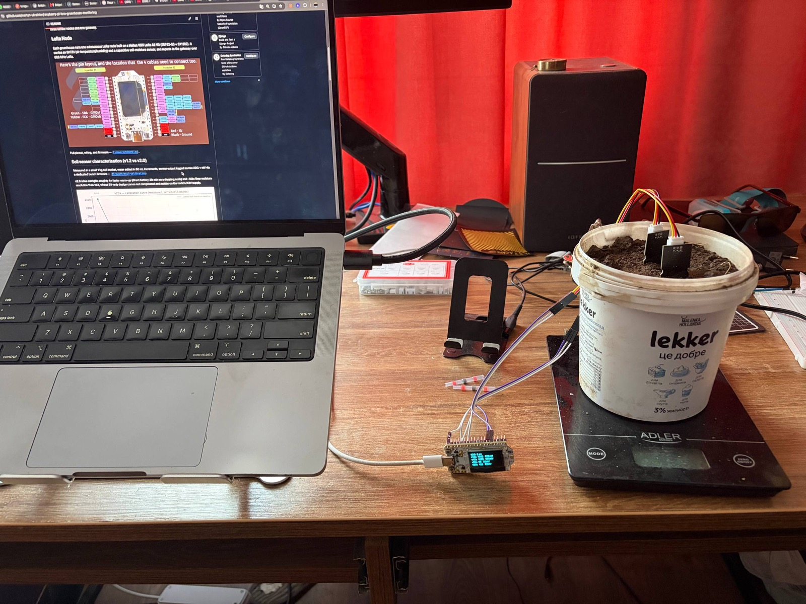

# Гайд: калібрувальний стенд для ґрунтового датчика

Як зібрати стенд, зняти криву «вода → показник» для свого ґрунту й порівняти
датчики між собою. Це та сама процедура, якою отримані числа в
[дослідженнях](../research/index.md). Розрахунок часу: збірка ~1 год, один
прогін кривої — 3–4 год (8–15 точок по 15 хв).



## Що потрібно

**Залізо**
- Heltec WiFi LoRa 32 V3 + USB-кабель
- 1–4 ємнісні датчики вологості ґрунту (v2.0; v1.2 теж можна — для порівняння)
- SHT31 (температура) — **обов'язково**, без нього дрейф не пояснити
- Dupont-дроти, макетка або клемники PCT-212

**Розхідники**
- Відро **без дренажу** (або заткнути отвори)
- ~1 кг **сухого** ґрунту з тієї ж теплиці — кілька днів відкритим, не «з пакета»
- Шприц 20–50 мл або мензурка, склянка води
- Кухонні ваги, плівка накрити відро

**Софт**: репозиторій, Docker, `make setup-host` (PlatformIO), `uv`.

## 1. Підключення

| Канал у CSV | Датчик AOUT → GPIO | Роз'єм |
|---|---|---|
| `v12a` | GPIO2 | J3 pin 13 |
| `v12b` | GPIO3 | J3 pin 14 |
| `v20a` | GPIO4 | J3 pin 15 |
| `v20b` | GPIO5 | J3 pin 16 |

- VCC датчиків → **`Ve`** (J2 pin 3/4). Не 3V3: прогрів `T±k` міряється лише
  справжнім зняттям живлення, а це робить команда на `Ve`.
- GND — спільна.
- SHT31: SDA → GPIO41 (J3 pin 8), SCL → GPIO42 (J3 pin 7), VIN → 3V3, GND.
  Можна підключити гарячим — прошивка підхопить.
- Мітки каналів у `SOIL_LABELS` (`src/main.cpp`, ~рядок 48) мають відповідати
  тому, що реально встромлено — інакше «v1.2 проти v2.0» перемішається непомітно.
- Усі датчики тільки на ADC1 (GPIO1–10).

## 2. Прошити й перевірити дроти

```bash
cd firmware
export SERIAL_PORT=/dev/cu.usbserial-0001     # свій порт
make deploy-soil-cal
make soil-watch
```

`soil-watch` показує по рядку на канал і присуд: `OK` / `ПЛАВАЄ` (пін ні до
чого не підключений) / `НУЛЬ` (нема дроту або живлення). Присуд — з поведінки
за ~10 замірів, не з одного значення. Далі — **вирішальний тест**: вилий
трохи води прямо на зонд. Показник має впасти на сотні мВ **миттєво**. Якщо
рівень стабільний, але на воду не реагує — дюпон не сидить (частіше за все —
земля). Вийти з монітора перед наступним кроком: він тримає той самий порт.

## 3. Запустити логер

```bash
make soil-log RUN=my-soil-v20
```

Пише `firmware/soil-calibration/data/my-soil-v20-<дата-час>.csv`, кожен рядок
одразу на диск, і приймає команди з клавіатури (Enter після кожної):

| Команда | Дія |
|---|---|
| `50` або `w 50` | долив 50 мл → рядок з `event=water+50.0`, `water_ml` наростає |
| `d` / `s` | мітка сухого / мокрого еталона датчика |
| `n текст` | нотатка (`n weight=1450`) |
| `c 30 60` | крива прогріву: 60 с без живлення, потім вікно 30 с |
| `x` / `o` | зняти / подати `Ve` (OLED гасне — це індикатор) |
| `r` | новий прогін: обнулити час і воду |
| `p 500` | період заміру, мс |
| `q` | зупинити логер |

Колонки CSV: `elapsed_s, water_ml, event, <канал>_raw, <канал>_mv, …, air_t, air_h`.
Порівнювати плати між собою — тільки по `_mv`. Якщо SHT31 нема — поле порожнє,
не нуль.

## 4. Зняти криву

**Крок 0 — межі датчика, до ґрунту.** Усі датчики в повітрі → 30 с → `d`.
У склянку води по білу риску → 30 с → `s`. Витерти. Це межі *датчика*, не
шкали ґрунту — в `map()` вони не йдуть.

**Крок 1 — суха точка.** Встромити в сухий ґрунт по білу риску (вище —
електроніка), рознести по відру, не торкатись стінок і одне одного. 10 хв.
Це `water_ml = 0`.

**Крок 2 — цикл доливів.** Повторювати, поки вода не почне стояти на поверхні:

1. Влити порцію **по колу вздовж стінки**, малими дозами, **не на датчик**.
2. Одразу набрати число мл + Enter.
3. Чекати **рівно 15 хвилин**. Не «доки стабілізується» — усталення не настає
   (від 1-ї до 15-ї хвилини показник іде ще ~100 мВ), тому тільки фіксований час.
4. Накрити відро плівкою, щілина під дроти.
5. Зважити, записати `n weight=…` — контроль випаровування.

Розмір порції: для 1 кг у маленькому відерці почни з 20 мл і подивись перший
зсув: менше 30 одиниць ADC — лий 40–50 мл; більше 200 — по 10 мл. Ціль —
8–15 точок. Коли порція перестала давати очікуваний зсув — далі вимішувати
ґрунт до однорідності й встромляти назад (похибка перевстромляння ~9 мВ).

**Крок 3 — стоп.** Вода стоїть на поверхні або збирається на дні → `q`.

## 5. Порахувати

```bash
make soil-summary                      # найсвіжіший CSV
make soil-summary CSV=data/my-soil-v20-....csv
```

Друкує по датчику: таблицю «вода → показник» з дельтами, нахил (мВ/мл), R²,
σ (шум спокою) і **мінімальну помітну порцію** (крок менший за 2–3 σ датчик
не бачить). Береться не середнє по кроку, а **хвіст** — останні 60 с перед
наступним доливом (`--tail`).

Графік кривої:

```bash
uv run --with matplotlib --with scipy tools/plot_calibration_curve.py \
  --csv data/my-soil-v20-....csv --sensor v20a        # → data/calibration_curve.png
```

Інші інструменти в `tools/`: `soil_swap.py` (датчики по черзі в одній ямці —
чесніше за 4 канали), `soil_warmup.py` (`T±k` через команду `c`),
`serial_tee.py` (тихий фоновий запис), `phase0.py` (чи псує Wi-Fi вимір).

## 6. Що з цим робити далі

Очікувана форма: `мВ = C + A·exp(−V/k)` — кожна наступна однакова порція рухає
показник дедалі слабше. Лінійний `map()` по двох точках завищить вологість у
мокрій половині. Для прошивки потрібна або ця формула, або таблиця точок.

**Мокрий кінець з відра в теплицю не переноситься** (без дренажу — це
заболочування). Для шкали поливу мокру точку знімати на грядці: суха ділянка →
15 хв → полити як звичайно → 15 хв.

## Пастки

1. **Відкрите відро** випаровує десятки мл за 3–4 год — зсув осі X. Накривати й зважувати.
2. **Відро з дренажем** — `water_ml` бреше.
3. **Лити на зонд** — локальна пляма, +240 мВ розбіжності між датчиками.
4. **Кожен дотик до датчика** — ~58 мВ (ущільнення ґрунту). Переміряти базу.
5. **`R15` порівнюється тільки з `R15`**; точка на 5-й хвилині — інша величина.
6. **Кроки різного розміру** порівнюються тільки як Δ/мл.
7. **Без SHT31** повільний дрейф має два однаково правдоподібних пояснення;
   у теплиці температура дає 4–8 % шкали артефакту за добу.
8. **Одна константа на дві моделі датчиків не працює** (28 % vs 7 % на тому ж ґрунті).
9. **`soil-log`, `soil-watch`, `make monitor`** — один порт, разом не запускати.
10. **Фоновий логер без `os.setsid()`** зупиняється по SIGTTIN: процес живий,
    файл не росте. `serial_tee.py` це вже лікує.
11. **Не плутати `T±k` (секунди, датчик) і `R15` (хвилини, ґрунт).**
