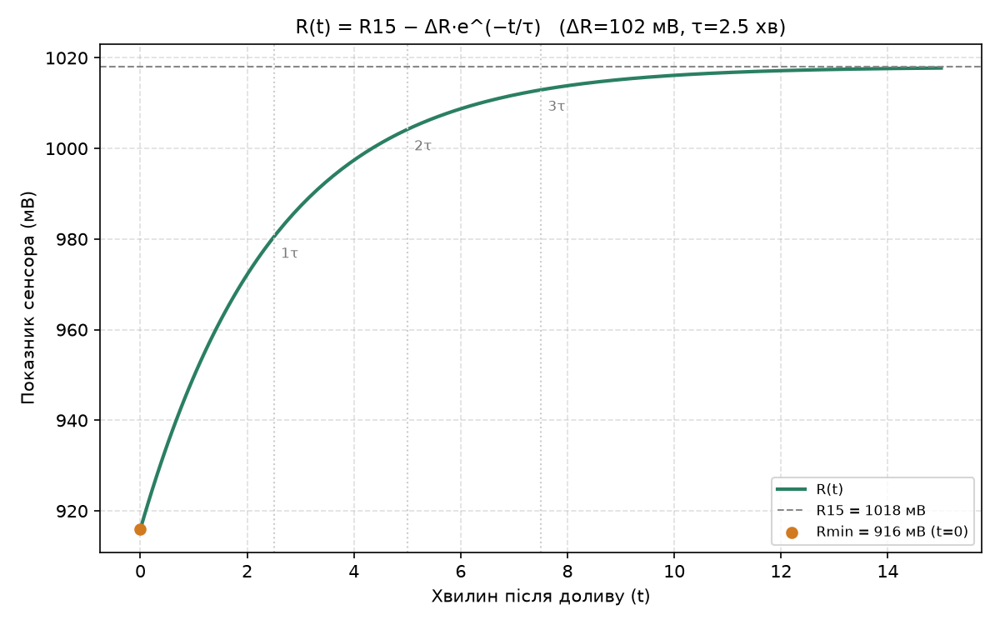
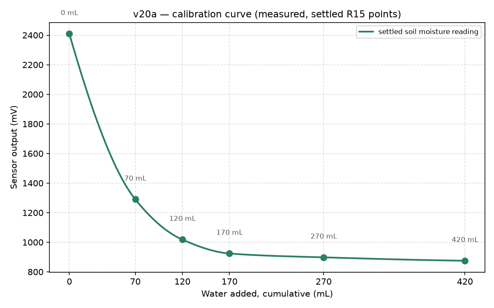

# Дослідження: стрічка часу

Тут — що ми міряли, в якому порядку, що з того вийшло і яке рішення прийняли.
Кожен етап має **питання**, на яке відповідає, і **критерій закриття**. Сирі
логи з усіма таблицями лишаються в `docs/калібрування-ґрунту.md` і
`docs/журнал.md`; тут лише методика, ключові числа й висновки.

Датчики, про які йдеться: ємнісні датчики вологості ґрунту v1.2 (TENSTAR) і
v2.0 («corrosion resistant»), на платі Heltec WiFi LoRa 32 V3.

---

## 2026-08-21 — Енергоаудит вузла

**Питання.** Скільки проживе вузол від 18650 (3400 мАг), і що треба змінити,
щоб він жив місяці, а не дні.

**Що зробили.** Розрахунок по даташитах (±30 %) для кожного режиму плати.

| Режим | Струм | Ресурс |
|---|---:|---:|
| `greenhouse-node` як є (безперервно, OLED, Serial) | 69 мА | **≈ 1,7 доби** |
| deep sleep, але датчики висять на 3V3 | 5,7 мА | ≈ 21 день (стеля) |
| deep sleep 5 хв, датчики на `Ve` | — | 1,6–2,4 міс |
| deep sleep 15 хв, датчики на `Ve` | — | **3,5–5,4 міс** |

**Висновок.** Безперервний вузол — тільки стендовий. Бойовий — спить 15 хв,
живить датчики з вимикуваної лінії `Ve`. Так з'явилась прошивка
`greenhouse-node-lowpower`. Заодно виявилось, що 300 мс прогріву датчиків після
холодного старту замало — звідси потреба *виміряти*, скільки треба насправді.

Повний розрахунок: `docs/power-budget.md`.

---

## 2026-08-22 — Етап 1: вибір датчика ✅ закрито

**Питання.** v1.2 чи v2.0, і чи взаємозамінні екземпляри однієї партії.

**Стенд.** Окрема прошивка `soil-calibration`: 4 датчики в одному відрі з 1 кг
тепличного ґрунту, сирий ADC + мВ у CSV по USB щосекунди, Python-інструменти
для підсумків і графіків. Чому окрема прошивка, а не бойова: стенду потрібен
Serial, безперервний запис і команди доливу, бойовій — навпаки.

**Метрики, які довелось вигадати.**

- `T±k` — час після подачі живлення, за який показник входить у коридор ±k мВ
  від полиці. Це і є потрібний прогрів.
- `R15` — усталений відлік через 15 хвилин після доливу. Порівнювати можна
  тільки `R15` з `R15`: точка через 5 хвилин лежить на ~50 мВ нижче, і це не
  шум, а інша величина.

**Результат.**

| | v1.2 | v2.0 |
|---|---:|---:|
| шум σ | 2,9 мВ | **1,05 мВ** |
| прогрів `T±10` після холодного старту | 0,4 с | **0,1 с** |
| розмах повітря → ґрунт | 128 мВ | **307 мВ** |
| працює на 3,3 В без перепайки | ні | **так** |
| розкид між двома екземплярами | 2 мВ | 3–5 мВ |

**Рішення: v2.0.** Утричі тихіший — утричі дрібніший крок вологості, який ще
видно. Учетверо швидший прогрів — прямий виграш батареї на вузлі зі сном.
v1.2 конструктивно 5-вольтовий, на 3,3 В вузла виходить стиснутим і шумним.
Два v2.0 паралельно в одному відрі зійшлися до 3 мВ — одна константа на партію
працює.

**Що не змінили, хоч і могли.** `SOIL_WARMUP_MS` у прошивці — 10 000 мс при
заміряних ~500 мс. Скорочення в 20 разів дало б ~2× ресурсу батареї, але
заміряно на одному екземплярі, в сухому ґрунті, без запису температури —
чекає етапу 3.

---

## 2026-08-22 → … — Етап 2: калібрування 🔧 у роботі

**Питання.** Які сирі значення відповідають сухому й насиченому ґрунту, і якої
форми крива між ними.

**Що зробили на столі.** Доливали воду порціями по 50 мл, після кожної — `R15`.

| Вода, мл | мВ | мВ/мл |
|---:|---:|---:|
| 0 | 2409 | — |
| 70 | 1288 | −16,0 |
| 120 | 1018 | −5,4 |
| 170 | 924 | −1,9 |
| 270 | 898 | −0,26 |
| 420 | 874 | −0,16 |

Модель: `мВ = 874 + 1535 · exp(−V/52)`, RMS 0,6 %. Параметри мають фізичний
зміст: 874 мВ — асимптота (насичення), 52 мл — характерний об'єм для цього
відра з цим ґрунтом.

**Три висновки.**

1. **Відгук нелінійний.** Кожні наступні 50 мл рухають показник утричі слабше
   за попередні; перші 70 мл дають дві третини шкали. Лінійний `map()` у
   прошивці завищує вологість у мокрій половині — поріг поливу спрацює пізніше,
   ніж треба. Потрібна крива або таблиця, не дві точки.
2. **Температура домінує на довгій дистанції.** Нічний прогін 12,8 год: показник
   падав усю ніч (−1,5 мВ/год), дійшов до дна на світанку, коли кімната
   найхолодніша, і розвернувся, щойно потепліло — обидва датчики синхронно.
   Висихання тягне вгору слабше, ніж охолодження вниз. **SHT31 обов'язковий у
   будь-якому наступному прогоні**, інакше повільний дрейф має два однаково
   правдоподібних пояснення.
3. **Мокрий кінець з відра не переноситься.** Відро без дренажу: 470 мл на 1 кг
   — це заболочування, якого в грядці не буває. Взяти це число за верх шкали —
   теплиця впреться у 85–90 % і верх буде мертвий. Сухий кінець (2409 мВ)
   переноситься.

**Що лишилось.** Мокрий кінець у теплиці при реальному дренажі: суха ділянка →
`R15` → полити як звичайно → `R15`.
**Критерій закриття:** обидва кінці заміряні на тепличному ґрунті, функція
`soilRawToPercent()` переписана на ці числа.

---

## 2026-08-23 — Бічне: чи псує Wi-Fi вимір (фаза 0) ✅ закрито

**Навіщо.** Щоб знімати калібрування в теплиці без ноутбука: плата шле дані по
Wi-Fi в хмару, видно з телефона. Але передача — імпульси 200–300 мА, які
просаджують шину живлення, від якої живиться ADC. Якщо σ виросте з 0,6 мВ до
5 мВ, ми проміняли вимірювальний прилад на зручний.

**Дослід.** Та сама плата, ті самі датчики, три відрізки по 10 хв:
без Wi-Fi у прошивці (контроль) → радіо піднято постійно (найгірший випадок)
→ радіо вимкнене під час заміру, вмикається лише на відправку. Порівнюється σ,
не рівень. Рахує `tools/phase0.py`; USB — опорний тракт.

| σ «постійно» проти контролю | Рішення |
|---|---|
| < 2× | радіо можна тримати ввімкненим |
| 2–5× | тільки burst-режим |
| > 5× і burst не рятує | Wi-Fi для калібрування не годиться |

**Результат** (два v2.0 у ґрунті нерухомо, 10 хв на відрізок, ~600 замірів):

| Відрізок | Радіо | σ `A`, мВ | σ `B`, мВ |
|---|---|---:|---:|
| контроль | коду Wi-Fi нема | 0,91 | 1,02 |
| постійно + передача щосекунди | піднято весь час | 1,18 | 1,20 |

Зростання **1,30× і 1,18×** при порозі 2×; рівень не зрушив (870,4 мВ в обох
відрізках). **Wi-Fi практично нешкідливий.** Разом із цим падає припущення,
навколо якого будувалась гілка: радіо не треба ховати → жива сторінка на
платі можлива під час прогону, пачки можна не накопичувати, портал може
працювати паралельно з вимірюванням. Деталі — `docs/шум-від-wifi.md`.

---

## Попереду — Етап 3: сон

**Питання.** Чи можна довіряти числу, знятому після пробудження, так само як
числу з безперервного вузла. Навмисно не «оптимізація»: спершу валідація,
потім скорочення вікна.

**Схема.** Бойовий вузол і опорний безперервний **поруч, у тому самому ґрунті**
(інакше в різницю залізе проходження сигналу). Три горизонти:

| Що | Скільки | Чому |
|---|---|---|
| якість показників | доба (96 пробуджень) | оцінка середнього й розкиду |
| втрата пакетів | 3+ доби | рідкісна подія |
| brownout / watchdog / ресети | тиждень+ | раз на добу-тиждень |
| криві розряду обох | весь час | ціна безперервної роботи в мАг |

**Критерій:** середня різниця менша за 3σ опорного (~3 мВ) і не росте з
номером циклу. Лише після цього — скорочувати `SOIL_WARMUP_MS`.

## Попереду — Етап 4: полив

Не починається, доки шкала не заміряна: поріг у відсотках, які нічого не
означають, — це не поріг.

---

## Наскрізні уроки, куплені досвідом

1. **Справність каналу доводить реакція на зміну**, а не рівень і не
   стабільність. Плаваючий пін реагує на подачу `Ve`; датчик без землі дає
   стабільні 2,7 В з малим σ — обидва виглядають робочими. Тест: вилити воду на
   зонд — падіння на сотні мВ має бути миттєвим.
2. **Кожен дотик руками коштує ~58 мВ** (ущільнення ґрунту біля зонда). Після
   будь-якого втручання базу переміряти.
3. **`R15` порівнюється тільки з `R15`.**
4. **Температура обов'язкова** в тих самих даних.
5. **Логер зависає, якщо читає `/dev/cu.*` у фоні** (SIGTTIN). Лікується
   `os.setsid()`. Коштувало трьох втрат даних, двічі непомічених.
