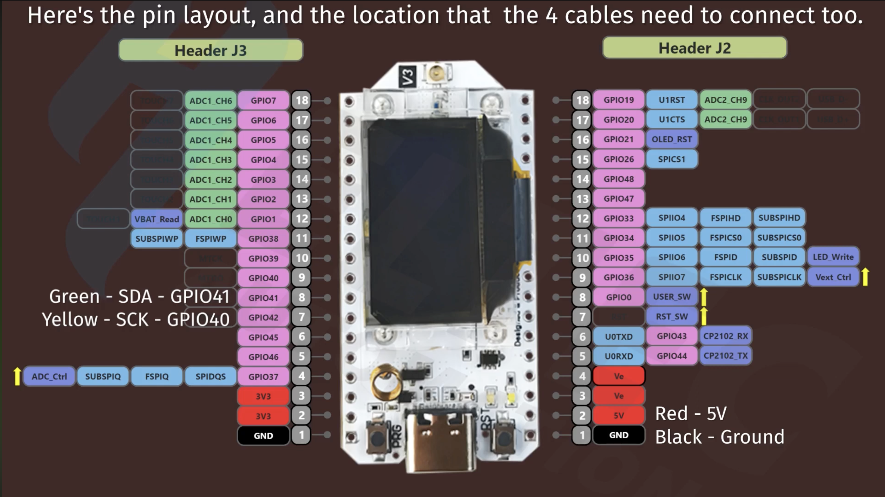

> [Українська версія](./README-UA.md)

# Firmware

PlatformIO projects for the greenhouse irrigation system's LoRa nodes.
Architecture and the wire protocol are described in [`docs/greenhouse_architecture.md`](../docs/greenhouse_architecture.md).

## Structure

- `greenhouse-node/` — greenhouse node (Heltec WiFi LoRa 32 V3, 863-928 MHz): sensors, valve, LoRa link to the base.
- `gateway/` — base station (LoRa receiver/transmitter, telemetry collection).
- `node_sensor/` — scaffold for additional sensor nodes.

## Pinout



The board has two headers, J3 (left) and J2 (right). LoRa (SX1262) and the
OLED are wired to fixed internal pins; the free ADC1 pins on J3 carry the
soil sensors, and a second I2C bus (`Wire1`) carries the SHT31 air sensor.
Full pin tables further down.

Soil moisture sensors are capacitive (v1.2 / v2.0): **AOUT** → GPIO2 (J3 pin
13), **VCC** → `Ve` (J2 pin 3/4, switched power), **GND** → J3 pin 1. v1.2 is
5V-only and behaves poorly at 3.3V (compressed/shifted range, false-high
moisture readings); v2.0 has an onboard regulator, adapts to 3.3-5.5V, and
testing also showed it's 4-5× less noisy — the better choice for battery
nodes. Details and measured results — see "Soil sensors" below.

## Setup

PlatformIO is only needed locally for `upload`/`monitor` (Docker on macOS has no USB access).
Install it under Python 3.11 via pipx specifically — on 3.13+/3.14 pip often has no prebuilt wheels
for `esptoolpy` dependencies (e.g. `cryptography`) and falls back to a source build that fails:

```
make setup-host
```

(one-off — once the venv is set up it stays on Python 3.11, no need to repeat).
`make upload`/`make monitor` check for `pio` themselves and install it if missing —
run `setup-host` manually only if the venv breaks (e.g. it was created under the wrong Python).

Check:

```
pio --version
```

## Building via Docker

Firmware compilation can run inside a container (no need to install PlatformIO on the host).
**Flashing the board (`upload`) still runs from the host** — Docker Desktop on macOS
doesn't pass USB ports through to the container.

Via `docker-compose.yml` (one service per project: `greenhouse-node`, `gateway`, `node_sensor`,
all sharing a single `agro-firmware` image — built once, cached for the rest):

```
cd firmware
docker compose run --rm greenhouse-node project init --board heltec_wifi_lora_32_V3
docker compose run --rm greenhouse-node run
```

No need to create the project folder (`greenhouse-node/`) by hand — Docker creates it for the bind-mount if it's missing.

Or directly, without compose:

```
docker build -t agro-firmware .
docker run --rm -v "$(pwd)/greenhouse-node:/project" agro-firmware run
```

## Makefile shortcuts

To avoid typing out long `docker compose run` commands every time, there's a `Makefile` with ready-made
targets (defaults to `greenhouse-node` / `heltec_wifi_lora_32_V3`, override via `PROJECT=` and `BOARD=`):

```
make init      # pio project init --board ... (once per project)
make build     # build via container (docker compose run)
make upload    # flash the board — from the host, because USB
make deploy    # build + upload in one call
make monitor   # serial console — from the host
make shell     # enter the container
make clean     # clean the build
```

Example for another project: `make init PROJECT=gateway BOARD=<board-id>`.

**The board port** (`SERIAL_PORT`) isn't hardcoded in `platformio.ini` (`upload_port`/`monitor_port` there read
`${sysenv.SERIAL_PORT}`) — macOS renumbers `/dev/cu.usbserial-N` differently each time, so the value
is set via an environment variable, with a default in the `Makefile`:

```
make upload PROJECT=gateway SERIAL_PORT=/dev/cu.usbserial-5
```

If several boards are connected at once — check each one's actual port via `ls /dev/cu.*`.

## Flashing firmware to the board

From the host, with `pio` installed locally:

```
cd firmware/greenhouse-node
pio run -t upload
```

## Board

Heltec WiFi LoRa 32 V3, HF variant (863-928 MHz, fits EU868).
PlatformIO board ID: `heltec_wifi_lora_32_V3`.

## Soil sensors (v1.2 / v2.0)

Capacitive soil moisture sensors. **v1.2** is rated for 5V only (needs manual
resistor rework to run on 3.3V), **v2.0** has an onboard regulator and adapts
itself to 3.3-5.5V — so for battery nodes (no 5V available) v2.0 is the
better choice.

Wiring (Heltec WiFi LoRa 32 V3, `greenhouse-node-lowpower`):
- **AOUT** → GPIO2 (J3 pin 13)
- **VCC** → `Ve` (J2 pin 3/4, switched by `Vext_Ctrl`/GPIO36 — powered only
  during the measurement window, not the always-on `3V3`)
- **GND** → J3 pin 1

Measured on the bench, dry air, same channel (`v12a`, `data/swap-session.csv`):
v1.2 raw ~2480-2491 (2092-2103 mV), v2.0 raw ~2874-2880 (2408-2414 mV) — v1.2
reads systematically lower even on a dry sensor, i.e. its output range at
3.3V is compressed/shifted down, which is exactly why v1.2 reports falsely
high moisture percentages.

Full calibration procedure (soil bucket, water additions, scale) —
[`firmware/soil-calibration/README.md`](soil-calibration/README.md).

### Findings: v1.2 vs v2.0 (2 sensors each)

Tested 2× v1.2 and 2× v2.0 side by side. v2.0 came out noticeably cleaner and
settled much faster — both matter for data quality and for the power-efficiency
work (shorter warmup = shorter `Ve` window = less battery drain):

| | noise σ | settle time |
|---|---|---|
| v1.2-A | 2.8 mV | 0.4 s |
| v1.2-B | 3.0 mV | 0.4 s |
| v2.0-A | 0.6 mV | 0.1 s |
| v2.0-B | 0.6 mV | 0.1 s |

Both units of each version matched each other, so it's not sampling noise —
v2.0 really is 4-5× quieter and ~4× faster to settle.

At ~12 mV/mL sensitivity, that noise floor sets the resolution limit (3σ):
- v1.2 — 0.75 mL
- v2.0 — 0.15 mL

v2.0 resolves a water addition 5× smaller than v1.2.

One correction: on the water side both versions turned out equally sensitive
(12.1 vs 12.6 mV/mL) — the earlier "v2.0 is 2.4× more sensitive" reading was
from the air→dry-soil range, not from water increments. v2.0's whole advantage
is quietness, not raw signal strength — the "switch to v2.0" conclusion still
holds, just for the right reason.

Reference points — air / dry soil / water (raw ADC, same session):

| | v1.2-A | v1.2-B | v2.0-A | v2.0-B |
|---|---|---|---|---|
| air (`dry_ref`) | 3061 | 3042 | 3019 | 3029 |
| dry soil (`water_ml=0`) | 2902 | 2880 | 2750 | 2761 |
| water (`wet_ref`) | 1906 | 1932 | 1349 | 1386 |

## OLED display

- Size: 0.96"
- Resolution: 128×64
- X: 0–127, Y: 0–63
- Font: `ArialMT_Plain_10`, ~10-12px/line, Latin script only (no Cyrillic glyphs)
- Last line without bottom clipping: `y=52`

## Pinout (Heltec WiFi LoRa 32 V3)

Compiled from `schema.png` (photo of the board pinout) + the pinout in `main.cpp`. The board has two headers — J3 (left) and J2 (right).

**Header J3 (left):**
| Pin | GPIO | Notes |
|---|---|---|
| 18 | GPIO7 | ADC1_CH6 |
| 17 | GPIO6 | ADC1_CH5 |
| 16 | GPIO5 | ADC1_CH4 |
| 15 | GPIO4 | ADC1_CH3 |
| 14 | GPIO3 | ADC1_CH2 |
| 13 | GPIO2 | ADC1_CH1 |
| 12 | GPIO1 | ADC1_CH0, VBAT_Read |
| 11 | GPIO38 | SUBSPIWP, FSPIWP |
| 10 | GPIO39 | MTCK |
| 9 | GPIO40 | MTDO — used as **SCL** (2nd I2C bus, air sensor) |
| 8 | GPIO41 | used as **SDA** (2nd I2C bus, air sensor) |
| 7 | GPIO42 | |
| 6 | GPIO45 | |
| 5 | GPIO46 | |
| 4 | GPIO37 | ADC_Ctrl↑, SUBSPIQ, FSPIQ, SPIDQS |
| 3 | 3V3 | |
| 2 | 3V3 | VIN (for 2nd I2C) |
| 1 | GND | GND (for 2nd I2C) |

**Header J2 (right):**
| Pin | GPIO | Notes |
|---|---|---|
| 18 | GPIO19 | U1RST, ADC2_CH9 |
| 17 | GPIO20 | U1CTS, ADC2_CH9 |
| 16 | GPIO21 | **OLED_RST** |
| 15 | GPIO26 | SPICS1 |
| 14 | GPIO48 | |
| 13 | GPIO47 | |
| 12 | GPIO33 | SPIIO4, FSPIHD, SUBSPIHD |
| 11 | GPIO34 | SPIIO5, FSPICS0, SUBSPICS0 |
| 10 | GPIO35 | SPIIO6, FSPID, SUBSPID, LED_Write↑ |
| 9 | GPIO36 | SPIIO7, FSPICLK, SUBSPICLK, **Vext_Ctrl**↑ |
| 8 | GPIO0 | USER_SW↑ (PRG/BOOT button) |
| 7 | — | RST_SW↑ (RESET button, not a GPIO) |
| 6 | GPIO43 | U0TXD, CP2102_RX |
| 5 | GPIO44 | U0RXD, CP2102_TX |
| 4 | Ve | |
| 3 | Ve | |
| 2 | 5V | |
| 1 | GND | |

**LoRa (SX1262, SPI)** — not on these headers, separate internal pins:
| Pin | GPIO |
|---|---|
| NSS (CS) | 8 |
| SCK | 9 |
| MOSI | 10 |
| MISO | 11 |
| RST | 12 |
| BUSY | 13 |
| DIO1 | 14 |

**OLED (I2C, `Wire`) + peripheral power:**
| Pin | GPIO |
|---|---|
| SDA | 17 |
| SCL | 18 |
| OLED_RST | 21 (= J2 pin 16) |
| Vext_Ctrl | 36 (= J2 pin 9, LOW = on) |

**Second I2C bus (air sensor SHT31) — separate from OLED, needs `Wire1`. Wiring diagram, Header J3:**

```
Pin #:    1     2     3     4      5      6      7      8      9      10     11     12
GPIO2:   GND   3V3   3V3  GPIO37 GPIO46 GPIO45 GPIO42 GPIO41 GPIO40 GPIO39 GPIO38 GPIO1
          |     |                                |      |
       ---+-----+--------------------------------+------+---------------------------------------
         GND   VIN                              SCL    SDA
       (SHT31)(SHT31)                         (SHT31) (SHT31)
```

```
Pin #:    1     2     3     4      5      6      7      8      9      10     11     12
GPIO2:   GND   3V3   3V3  GPIO37 GPIO46 GPIO45 GPIO42 GPIO41 GPIO40 GPIO39 GPIO38 GPIO1
          |     |                                |      |
       ---+-----+--------------------------------+------+---------------------------------------
         GND   VIN                              SCL    SDA
       (SHT31)(SHT31)                         (SHT31) (SHT31)
```

So physically on the SHT31 board: **GND → pin 1, VIN → pin 2, SCL → pin 7 (GPIO42), SDA → pin 8 (GPIO41)**.
Pins 3-6 and 9-12 in this diagram are unused.

**Free ADC1 pins for sensors** (ADC1, not ADC2 — ADC2 conflicts with Wi-Fi/LoRa), Header J3:
| Pin | GPIO | ADC channel |
|---|---|---|
| 12 | GPIO1 | ADC1_CH0 |
| 13 | GPIO2 | ADC1_CH1 |
| 14 | GPIO3 | ADC1_CH2 |
| 15 | GPIO4 | ADC1_CH3 |
| 16 | GPIO5 | ADC1_CH4 |
| 17 | GPIO6 | ADC1_CH5 |
| 18 | GPIO7 | ADC1_CH6 |

Soil moisture sensors (capacitive, v1.2) are currently wired to **GPIO2/3/4** (Header J3, pins 13/14/15).

VIN = purple
GND = grey

SCL = white - 7 (GPIO42)
SDA = black - 8 (GPIO41)
